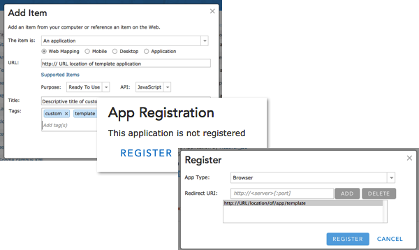
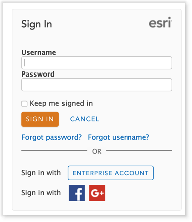

<!-- .slide: data-background="../../reveal.js/img/title.png" -->
#Security and ArcGIS Web Development
Julie Powell and Heather Gonzago

---

<!-- .slide: data-background="../../reveal.js/img/bg-5.png" -->
## **Agenda**
 - Types of apps
 - Traditional token-based authentication
 - OAuth2 authentication
 - User login authentication
 - Multi-factor authentication
 - Application authentication
 - Resource proxy
 - Service proxy

---

<!-- .slide: data-background="../../reveal.js/img/bg-5.png" -->
## **Types of apps**
  - How are you interacting with the application?
  - Are the end users known to the application?
    - User-login
      - Application allows user to log in with valid credentials
  - Are the end users unknown to the application?
    - App-login
      - App provides credentials within the app itself

---

<!-- .slide: data-background="../../reveal.js/img/bg-5.png" -->
## **Agenda**
 - Types of apps
 - Traditional token-based authentication
 - OAuth2 authentication
 - User login authentication
 - Multi-factor authentication
 - Application authentication
 - Resource proxy
 - Service proxy

---

<!-- .slide: data-background="../../reveal.js/img/bg-5.png" -->
## **Traditional server-based token authentication**
 - Classic way to access secured services
 - Username and password sent over https
`/generateToken` call
 - Short-lived token response
 - Handled via SDK’s Identity Manager component
 - Everything handled on the client
 - Web application responsible for keeping credentials secure

---

<!-- .slide: data-background="../../reveal.js/img/bg-5.png" -->
## **generateToken**
 - Access secured service with server-based token authentication
 - Identity Manager takes care of most of this work
 - Challenge for credentials `https://<server>/sharing/rest/generateToken`
 called when credentials are passed
 - Token appended and used to unlock these services

---

<!-- .slide: data-background="../../reveal.js/img/bg-2.png" -->
## **Demo: Traditional token-based authentication**

---

<!-- .slide: data-background="../../reveal.js/img/bg-5.png" -->
<!-- .slide: data-notes="ArcGIS Based services. User logins, you write the app, and the application is responsible for accessing the credentials from the user and keeping these credentials safe" -->
## **generateToken limitations**
 - The web application has access to credentials
 - The application is responsible for recognizing when to prompt for login
 - No enterprise logins
 - Need to sign in every time calls made to a secure service
 - Can’t track how the app is being used
 - Can’t list in Marketplace

---

<!-- .slide: data-background="../../reveal.js/img/bg-5.png" -->
## **Agenda**
- Types of apps
- Traditional token-based authentication
- OAuth2 authentication
- User login authentication
- Multi-factor authentication
- Application authentication
- Resource proxy
- Service proxy

---

<!-- .slide: data-background="../../reveal.js/img/bg-5.png" -->
## **OAuth2 authentication: why and when**
- Why you may want to use OAuth2
  - The registered app provides information on how the application is being used, whom is accessing it, credit usage, etc?
- When to use OAuth2
  - Access users’ private data
  - Create and publish content
  - Access premium content and services on AGO

---

<!-- .slide: data-background="../../reveal.js/img/bg-5.png" -->
## **Register your app**
- Possible in organizational online and portal site, on-premise portal (as of 10.3), or Developers site
- Generates:
  - App ID (client_id)
  - App Secret (client_secret)

---

<!-- .slide: data-background="../../reveal.js/img/bg-5.png" -->
## **Demo: Register your app**

---

<!-- .slide: data-background="../../reveal.js/img/bg-5.png" -->
## **Agenda**
- Types of apps
- Traditional token-based authentication
- OAuth2 authentication
- User login authentication
- Multi-factor authentication
- Application authentication
- Resource proxy
- Service proxy

---

<!-- .slide: data-background="../../reveal.js/img/bg-5.png" -->
## **OAuth2: User login authentication**

- Works with named users
- Server-side login page
- Provides single sign-on
  - If already in active portal session,  
  user is not required to enter credentials again
  - Approval screen to grant access to the app

---

<!-- .slide: data-background="../../reveal.js/img/bg-5.png" -->
## **OAuth2: User login workflows**
 - Working with browser-based or mobile applications?
   - 1-step workflow, i.e. Implicit Grant

 - Desktop, mobile, or server-side web application?
  - 2-step workflow, i.e. Authorization Grant

---

<!-- .slide: data-background="../../reveal.js/img/bg-5.png" -->
## **OAuth2: 1 step user-login workflow**

  1. App directs user to `/authorize` endpoint
  2. Valid user/pass?
  3. Redirect back to app at provided `redirect_uri`
  4. `access_token` is added to URL
  5. [App can parse the URL for token use](https://developers.arcgis.com/authentication/browser-based-user-logins/#parse-the-token-from-the-url)

---

<!-- .slide: data-background="../../reveal.js/img/bg-5.png" -->
## **OAuth2: Identity Manager**
- Client SDKS provide OAuth2 functionality via the Identity Manager
- Handles the complexity of calling endpoints and parsing tokens
- Example: JS API Identity Manager
  - `OAuthInfo` class -> pass in registered `App ID`
  - Pass this information to the Identity Manager

---

<!-- .slide: data-background="../../reveal.js/img/bg-5.png" -->
## **Demo: OAuth2 login**

---

<!-- .slide: data-background="../../reveal.js/img/bg-5.png" -->
## **Multi-factor authentication**

Another level of security -
can't just rely on only one method, need to have both password and device
Two administrators
Google or Microsoft Authenticator

---

<!-- .slide: data-background="../../reveal.js/img/bg-5.png" -->
## **Demo: Multi-factor authentication**

Update screen captures!!!!!!!

---

<!-- .slide: data-background="../../reveal.js/img/bg-5.png" -->
## Enterprise logins

- Login to ArcGIS Online using your enterprise login (Active Directory, LDAP, …)
- Uses the SAML standard
- [Setting up Enterprise Logins](http://doc.arcgis.com/en/arcgis-online/administer/enterprise-logins.htm)
 
- Nothing changes for the App Developer
  - Use standard OAuth workflow (redirect user to /authorize URL as usual)
  - Portal detects enterprise login if configured for the organization
  - Redirects user to their enterprise provider
  - Enterprise redirects user to portal upon login
  - Portal generates token and sends it to the app

---

<!-- .slide: data-background="../../reveal.js/img/bg-5.png" -->
## **Agenda**
 - Types of apps
 - Traditional token-based authentication
 - OAuth2 authentication
 - User login authentication
 - Multi-factor authentication
 - Application authentication
 - Resource proxy
 - Service proxy

---

<!-- .slide: data-background="../../reveal.js/img/bg-5.png" -->
## **OAuth2: application authentication**

- Users of the App are unknown to the ArcGIS platform
- No login prompts
- App logs in to the ArcGIS platform on behalf of itself
- App must contain valid app credentials
- App is responsible for keeping the app secret secure

---

<!-- .slide: data-background="../../reveal.js/img/bg-5.png" -->
## **OAuth2: app authentication workflow**

  1. App makes POST to `/token` endpoint 
  with `client_id`   and `/client_secret`   with `grant_type=client_credentials`

  2. `Access_token` in JSON response

  3. Parse token and use in requests as needed

---

<!-- .slide: data-background="../../reveal.js/img/bg-5.png" -->
## **Limitations with app authentication**

- Applications can only read or query private data content.
- Cannot modify, upload, create, or delete content.
- Content Restrictions
- Members of an AGO org can only access private content owned by the person who created the application.
- Marketplace restrictions
- Cannot list applications in ArcGIS Marketplace. In order to do so, must work with user logins.

---

<!-- .slide: data-background="../../reveal.js/img/bg-5.png" -->
## **App logins: proxy use case steps**

1. Register app
2. Configure proxy with app credentials
3. Proxy uses app credentials to get app token from the portal
4. Front-end app calls into the proxy
5. Proxy uses app token to call into secured portal resources
6. Proxy returns results to the app

---

<!-- .slide: data-background="../../reveal.js/img/bg-2.png" -->
## **Demo: app authentication**
TODO- screen capture and url link

---

<!-- .slide: data-background="../../reveal.js/img/bg-5.png" -->
## **OAuth2: Security with application authentication**
- Never expose client_secret
- Keep secure server-side in proxy
- Rate limiting against server-based misuse
- Web-tier authentication,
  -users sign into your application, only your authenticated users  
  would be able to use your application to access premium content and services.

---

<!-- .slide: data-background="../../reveal.js/img/bg-5.png" -->
## **Updated proxy files**

- [https://github.com/Esri/resource-proxy](https://github.com/Esri/resource-proxy)
- DotNet, JSP, and PHP
- Access resources secured with token-based authentication, i.e. premium credit-based services
- Resource and referer-based rate limiting
- Access cross domain resources
- Enabled logging

---

<!-- .slide: data-background="../../reveal.js/img/bg-5.png" -->
## **Proxies**

- Install proxy based on README.md file
- Can also use token based authentication in addition to OAuth2
- Locking it down by referrer: Only requests coming from listed referrers are proxies
- Rate limits
  - rateLimitPeriod: The time period (in minutes) which the rateLimit is tracked.
  - rateLimit: Maximum number of requests for a specific referer over the given rateLimitPeriod.

---

<!-- .slide: data-background="../../reveal.js/img/bg-5.png" -->
## **Agenda**
 - Types of apps
 - Traditional token-based authentication
 - OAuth2 authentication
 - User login authentication
 - Multi-factor authentication
 - Application authentication
 - Resource proxy
 - Service proxy

---

<!-- .slide: data-background="../../reveal.js/img/bg-5.png" -->
## **Service proxy**

 PUT IN SLIDE showing what this is and how to access it

---

 <!-- .slide: data-background="../../reveal.js/img/bg-5.png" -->
## Conclusion

- Use OAuth2 for user logins
- Benefits include usage tracking, enterprise logins, etc.
- Identity Manager simplifies login workflow in client SDKs
- Use app tokens to access secured resources in certain use cases
- [https://developers.arcgis.com/authentication](https://developers.arcgis.com/authentication) for additional information.

---

 <!-- .slide: data-background="../../reveal.js/img/bg-5.png" -->
# Questions

---
