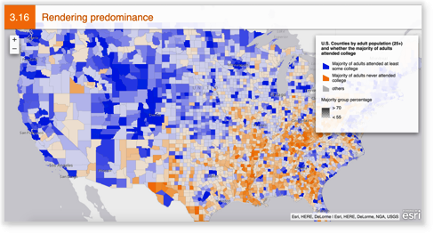
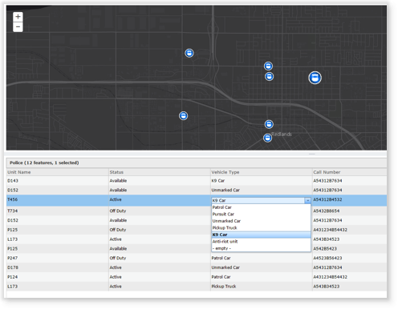
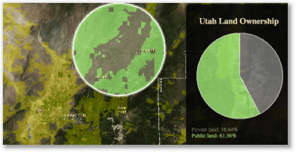

<!-- .slide: data-background="../../reveal.js/img/title.png" -->
#What's New in the ArcGIS API for JavaScript
Julie Powell, Heather Gonzago, and Yann Cabon

---

<!-- .slide: data-background="../../reveal.js/img/bg-5.png" -->
## **Hello**
 

---

<!-- .slide: data-background="../../reveal.js/img/bg-5.png" -->
## **Agenda**
- What's new: 3x
- Introducing 4.0
- Resources
- Additional sessions
- Questions

---

<!-- .slide: data-background="../../reveal.js/img/bg-5.png" -->
<!-- .slide: data-notes="Multivariate maps depict two or more attributes or variables from a dataset in a single map. It does this by using visual variables. These are variables you can set on your renderer to specify how you want to visually convey your data.
ColorInfo defines how a continuous color ramp is applied to features based on the values of a numeric field attribute.
SizeInfo can be used to visualize the true sizes of features (e.g. tree canopy, road width, building height, etc.) based on their size in the real world.
OpacityInfo defines the opacity of the features based on a numeric field attribute value.
 This map displays three attributes that are mapped using three different visualization techniques.
The sample uses a UniqueValueRenderer to shade each county in the U.S. with one of two colors – green or purple. Green features are counties where the majority of adults (25 years of age or older) attended at least some college in their lifetime. Counties shaded with purple are areas where the number of adults who never attended any college outnumbers those who attended at least some college. 
Size is used to show the count of a particular attribute in each feature.To gain additional insight into our data, the sizeInfo visual variable is used to visualize the adult population in each county.
Opacity is used to depict the strength of the predominance in each unique value. Because opacity is good for depicting strength, we’ll use it to show the strength of the majority population in each county. We’ll shade features with full opacity if the majority group (either attended college or did not attend college) outnumbers the minority 3:1 or makes up at least 75% of the total adult population." -->

## **Rendering improvements: Multivariate rendering**


- Use VisualVariables
 - ColorInfo -> defines color ramp
 - SizeInfo -> defines symbol size feature size proportional to data
 - OpacityInfo -> defines the opacity of features
 

 

---

<!-- .slide: data-background="../../reveal.js/img/bg-5.png" -->
<!-- .slide: data-notes="There is now scale driven sizing for polygon markers and outlines based on map-scale. We do this by setting the sizeInfo visualVariable.
 You need to specify the stops which is just a array of objects that define the maximum size of the symbol at various values of the expression. The expression, in this case, is the map (or view) scale.
This sample displays farm expenses throughout the United States. It does this by setting visualVariables on the renderer. One visual variable determines the size of the circle based on the value of the specified attribute field, whereas another determines the outline width of the polygons based on the map scale. 
The expression is set to 'view.scale', which corresponds to the map's scale. The size represents the maximum symbol size (in pixels) that corresponds to this scale." -->

## **Rendering improvements: Scale-driven sizing**

- Calculate symbol size based on map scale (SizeInfo)
- Use on polygon markers and outlines
- Stops
- Expression, e.g. <code>view.scale</code>

---

<!-- .slide: data-background="../../reveal.js/img/bg-5.png" -->
<!-- .slide: data-notes="Mapping predominant values is a popular visualization technique for communicating the dominant attribute when two or more competing attributes are considered.
This map shows a single feature layer of U.S. counties with two competing numeric fields; one contains the number of adults who attended college, and the other the number of adults who did not. They are competing because all adults fall into one of these categories – not both and not none. Blue features indicate counties where more adults attended college than those who didn’t. Red features depict the inverse – more adults did not attend college than those who did. Opacity is optionally used to show the strength of the predominant variable. If a county is shaded with a very opaque color then the 'winning' category won by a large margin, whereas transparent features indicate the competing variables are nearly equal to each other." -->

## **Rendering improvements: Show predominance**

- Generates UniqueValueRenderer showing  predominant value for each feature
- Compares among two+ competing fields
- Supported on hosted feature services
- Good [app](http://arcg.is/1QiDrjP) discussing this

---

<!-- .slide: data-background="../../reveal.js/img/bg-5.png" -->
<!-- .slide: data-notes="Version 3.15 introduced the ArcGIS Symbol Playground. This sample provides a place to explore symbol capabilities of the API. Here you can try out new features, customize them, and copy the generated code into your own application. It also provides a starting point so as to allow use of these features as quickly as possible.
The sample works with symbols such as: SimpleMarkerSymbol, SimpleLineSymbol, SimpleFillSymbol, CartographicLineSymbol, PictureMarkerSymbol, PictureFillSymbol, and TextSymbol. The playground displays the symbol in addition to providing an easy-to-use UI for modifying properties. Once modified, the symbol updates appropriately while updating the sample snippet displaying how it appears in code." -->

## **Symbol playground**

<a href="https://developers.arcgis.com/javascript/jshelp/intro_bettermaps.html">Data visualization techniques</a>

---

<!-- .slide: data-background="../../reveal.js/img/bg-5.png" -->

## **Added support for OGC Web Feature Services (beta)**

---

<!-- .slide: data-background="../../reveal.js/img/bg-5.png" -->

## **Widgets: FeatureTable**

- Out of beta at 3.15
- 3.16 introduces editing support
 - attributes of existing features
- Customize UI
- Reorder columns

---

<!-- .slide: data-background="../../reveal.js/img/bg-5.png" -->

## **Widgets: Elevation profile**

Creates an elevation profile based on an input polyline geometry

---


<!-- .slide: data-background="../../reveal.js/img/bg-5.png" -->

## **Widgets: LayerList**

</a>

---

<!-- .slide: data-background="../../reveal.js/img/bg-5.png" -->
<!-- .slide: data-notes="http://www.arcgis.com/home/group.html?id=30de8da907d240a0bccd5ad3ff25ef4a

Show operational layer
Demo:
1. Copy basemap layer in Online
2. Style using style editor
3. Bring into app
4. "http://maps.esri.com/AGSJS_Demos/templates/VectorBasemapStyleEditor/index.html"
5. "http://developers.arcgis.com/javascript/sandbox/sandbox.html?sample=layers_vector" -->

## **3.15 & 4.0: Vector tiles**


- Esri vector tile basemaps
- Custom vector tile maps published from Pro
- Map Style
 - Use as-is in apps
 - Use a tool like <a href="http://maps.esri.com/AGSJS_Demos/templates/VectorBasemapStyleEditor/index.html">this</a> to  customize style & save as a item
 - Style dynamically in code
- Programmatically update map
 - styling or layer visibility

---

<!-- .slide: data-background="../../reveal.js/img/bg-5.png" -->

## **3:13+ & 4.0: Geometry Engine Overview**

- <a href="https://developers.arcgis.com/javascript/jsapi/esri.geometry.geometryengine-amd.html">Geometry Engine out of beta at 3.15</a>
 
- <b>What is it?</b>
 - 30+  methods for measuring, overlaying, and testing spatial relationships
- <b>Why and when should you use this?</b>
 - Use if application makes frequent requests with GeometryService or handles large amounts of geometries.
- Client-side =  No network requests made
- ~ 160 GZipped
- Reasons to use the GE include:
 - Working with spatial relationships and editing
 - Measurements
 - Overlay analysis

---

<!-- .slide: data-background="../../reveal.js/img/bg-5.png" -->
<!-- .slide: data-notes="The power of the geometry engine can really be seen with the client-side editing experience. What edit operations that may have once taken quite a bit of time to complete now takes a fraction of that time using the spatial relationship testing methods and edit operations.
This sample demonstrates several GeometryEngine methods including cut, geodesicArea, union, and difference. But it’s the testing functions (offset, disjoint, equals, within, intersects, and crosses) that allow this application to perform the proper cutting, merging, deleting and creating of new features.
Really helps enhance the user experience of editing geometries in web applications.
Does not contain ALL operations that GeometryService has, for  example, project, fromGeoCoordinateString, simplify, and trimExtend are not included." -->

## **GE: Spatial relationships and editing**



- Spatial relationships are verified before  editing using testing functions
 - offset, disjoint, equals, within, intersects, and crosses  
- Operations (intersect, cut, etc.) perform quicker
- No multiple <code>GeometryService</code> requests when  testing relationships and actual edit operations
- Overall should enhance the user's editing experience
 
---

<!-- .slide: data-background="../../reveal.js/img/bg-5.png" -->
<!-- .slide: data-notes="GeometryEngine supports only WGS84 geographic coordinate system. Use geodesic methods when working in WGS84 or Web Mercator and use planar methods when working with data defined in a PCS.
The geodesic method approaches measurement differently from the planar method and thus may generate different results depending on the geometry and the location.
Notice how the shapes of the geodesic buffers (symbolized in green) become more distorted as they approach the poles, while the shapes of the planar buffers (symbolized in orange) are all equal. The only location where both geodesic and planar buffers are exactly the same size and shape is the equator." -->

## **GE: Measurement**



- Measure lengths, areas, and distances

- Methods for both
 - Geodesic -> curvature of Earth
 - Planar -> flat (projected) Earth

- Geodesic supports WGS84  and Web Mercator

- Planar Not limited to WGS84 and Web Mercator

---

<!-- .slide: data-background="../../reveal.js/img/bg-5.png" -->
<!-- .slide: data-notes="Allows you to explore spatial relationships and perform preliminary calculations prior to doing hefty GIS analysis.
Note there are similar overlay functions available in the ArcGIS JavaScript API as analysis widgets, such as OverlayLayers, CreateBuffers,MergeLayers, etc. These widgets are very different from the overlay functions in GeometryEngine.
GeometryEngine’s methods work only with geometries, not attributes or layers." -->

## **GE: Overlay analysis**

- Overlay functions, e.g.
 - Clip
 - Difference
 - Intersect
 - Union
 - SymmetricDifference

- Provides a means of performing preliminary calculations prior to doing any major analysis


---

<!-- .slide: data-background="../../reveal.js/img/bg-2.png" -->

## **Agenda**

- What's new: 3x
- Introducing 4.0 
- Resources
- Additional sessions
- Questions

---

<!-- .slide: data-background="../../reveal.js/img/bg-5.png" -->

## ** 2D & 3D visualization**
 

---

<!-- .slide: data-background="../../reveal.js/img/bg-5.png" -->
<!-- .slide: data-notes="Demos:
http://julie/demos/3d/oildrilling.html
http://maps.esri.com/rc/sat2/index.html

http://maps.esri.com/AGSJS_Demos/templates/3D/Directions3D/index.html" -->

## **4.0: 3D Web Mapping Examples**

</a>

---

<!-- .slide: data-background="../../reveal.js/img/bg-5.png" -->

## **4.0: Visualization**

</a>

- Map model / view separation
- Same programming model for 2D and 3D
- 3D introduces additional capabilities/concepts
 - 3D symbology
 - Environment
 - Camera
 - Slides
 - Local scenes 
- <a href="https://blogs.esri.com/esri/arcgis/2016/01/19/3d-visualization-working-with-icons-lines-and-fill-symbols">Blog on visualization</a>

---

<!-- .slide: data-background="../../reveal.js/img/bg-5.png" -->
<!-- .slide: data-notes="Visual variables define the parameters for data-driven geographic visualizations of numeric data. They allow you to easily map continuous ramps of color, size, and/or opacity to minimum and maximum data values of one of the layer's numeric attribute fields.
Top map: UniqueValueRenderer: predominant education attainment
Bottom map: UniqueValueRenderer to shade each county with a color depending on the dominant crop harvested for the year (e.g. purple represents wheat, green cotton, etc.). Size and opacity visual variables are then added to depict the size of the harvest and how strong the dominant crop was" -->

## **4.0: Visualization**

</a>

- Renderers
 - Simple
 - ClassBreaks
 - UniqueValue
- Visual Variables & multivariate mapping
 - Using symbol size, opacity, color
 - Thematic
 - Real-world sizes

---

<!-- .slide: data-background="../../reveal.js/img/bg-5.png" -->
<!-- .slide: data-notes="Web map is partially supported. Meaning it relies on the capabilities already available in the API. For example, web maps can be read even when they contain layer types that are not yet supported (i.e. WMS), but only the API-supported layer types will be displayed. Known limitations and the API ref can be used to get an idea of the specific capabilities supported. We will be expanding the documentation to make it easier for developers to determine what is possible with the current release of the API. Each release will expand on the API’s capabilities; eventually enabling full support for reading and (later) writing web maps." -->

## **4.0: Support for web maps and scenes**


- Map contains
 - basemap
 - operational layers
 - initial state
- WebMap/WebScene contains
 - portal item
 - presentations
 - environment options
- Scene can be global or local

---

<!-- .slide: data-background="../../reveal.js/img/bg-5.png" -->
<!-- .slide: data-notes="http://heatherg.esri.com/40JSSDK/sample-code/scene-local/index.html
Local scenes with a global extent (e.g. webmercator) don’t work very well at the moment (e.g. light) and they are not recommended.
https://blogs.esri.com/esri/arcgis/2015/11/18/whats-new-in-the-scene-viewer-november-2015
The WebScene class extends Map and can therefore be used to create a new map with additional properties specific to web scenes. The viewingMode property of WebScene determines whether the scene is global or local.
http://www.arcgis.com/home/webscene/viewer.html?webscene=51c67be4a5ea4da6948a40210ddfab1a" -->

## **Local scenes**

</a>

- World is flat
- Supports local PCS
- Possible to render data below the surface
- Optional 'clipping area' makes a custom size/extent of the map/view.
- <code>webScene.viewingMode = 'local'</code>

---

<!-- .slide: data-background="../../reveal.js/img/bg-5.png" -->
<!-- .slide: data-notes="Uses
http://www.arcgis.com/home/webscene/viewer.html?webscene=fe6f06ac89734d12b8fc8ecdeb89bb1c

Link to an app that passed in the portalId" -->


## **Global scenes**

</a>

- World is a globe
- Only supports WGS84 and  Web Mercator coordinate systems
- No subsurface rendering


---

<!-- .slide: data-background="../../reveal.js/img/bg-5.png" -->
<!-- .slide: data-notes="Show sample using ID manager and Oauth2
Explain how it is very similar to the 3x sample with the exception of different folder paths and a few caveats" -->


## **4.0: Security**


- Support for <a href="http://hgonzago.github.io/presentations/Dev-Summit-2016/whats-new/demos/IDManager/4x/index.html">IdentityManager</a>
- Use for token-based ArcGIS Server security
- Use with OAuth2 security against the ArcGIS platform


---

<!-- .slide: data-background="../../reveal.js/img/bg-5.png" -->
<!-- .slide: data-notes="" -->

##  **4.0: Tasks**


- ClosestFacilityTask
- Locator
- QueryTask
- RouteTask
- ServiceAreaTask
- ImageServiceIdentifyTask
- Locator
- QueryTask
- RouteTask
- ServiceAreaTask

---

<!-- .slide: data-background="../../reveal.js/img/bg-5.png" -->
<!-- .slide: data-notes="" -->

## **4.0: RouteTask**

</a>

Use RouteTask for Directions functionality
---

<!-- .slide: data-background="../../reveal.js/img/bg-2.png" -->

## **User Interface**


---

<!-- .slide: data-background="../../reveal.js/img/bg-5.png" -->
<!-- .slide: data-notes="" -->

## **User Interface: Creating apps that run across any device**

</a>


---

<!-- .slide: data-background="../../reveal.js/img/bg-5.png" -->
<!-- .slide: data-notes="Maybe show: https://devtopia.esri.com/pages/bjor3345/presentations/2016-holistic-testing/demos/ui/ui-padding.html
https://devtopia.esri.com/pages/bjor3345/presentations/2016-holistic-testing/demos/ui/view-padding.html" -->

## **UI: padding**

</a>

- Map view padding:  
Center, extent, etc. works off subsection of view

- UI padding:
Position widgets manually or in corners + offset from edge

---

<!-- .slide: data-background="../../reveal.js/img/bg-5.png" -->

## **UI: Widgets**


</a>


- OOB widgets @ 4.0
 - Attribution
 - BasemapToggle
 - Compass
 - Home
 - Locate
 - Popup
 - Search
 - Track
 - Zoom
 - Legend
- Style with css
---

<!-- .slide: data-background="../../reveal.js/img/bg-5.png" -->
<!-- .slide: data-notes="Using React for the UI: 
http://rene-mbp.esri.com/samples/presentations/2016-devsummit-plenary-jsapi/demos/uiux/
http://rene-mbp.esri.com/samples/presentations/2016-devsummit-plenary-jsapi/demos/react-nav/
" -->

## **UI: Widgets and view models**


</a>


- Separation between business logic & UI
 - ViewModel
 - View
- Replace OOB View with your own
- Use your framework of choice
---

<!-- .slide: data-background="../../reveal.js/img/bg-5.png" -->

## **UI: Popups**

 

---

<!-- .slide: data-background="../../reveal.js/img/bg-5.png" -->

## **Configurable web apps**

</a> 

---

<!-- .slide: data-background="../../reveal.js/img/bg-2.png" -->

## **Agenda**

- What's new: 3x
- Introducing 4.0
- Resources
- Additional sessions
- Questions

---

<!-- .slide: data-background="../../reveal.js/img/bg-5.png" -->

## **3.x & 4.x: Additional help and resources**

- [Visualization blogs](https://blogs.esri.com/esri/arcgis/2016/01/11/multivariate-rendering-2d-visualization-techniques-in-javascript/)
- [Geometry Engine blogs](https://blogs.esri.com/esri/arcgis/2015/09/09/geometryengine-part-1-testing-spatial-relationships-and-editing/)
- [SDK site](https://developers.arcgis.com/javascript/) 
- [GeoNet](https://geonet.esri.com/community/developers/web-developers/arcgis-api-for-javascript)

---

<!-- .slide: data-background="../../reveal.js/img/bg-5.png" -->

## **A few other sessions**

- ArcGIS API for JavaScript: Discover 4.0 the Next Generation / Wed. 2:30 Primrose A
- Vector Tiles in the ArcGIS Platform / Wed. 4PM Mohave
- Web 3D with the ArcGIS API for JavaScript Advanced Topics / Thur. 9AM Santa Rosa  
- Building Your Own Widget with ArcGIS API for JavaScript / Thur., 10:30AM Mohave
- An Insight into Esri’s 3D Engine in the Browser / Thur. 10:30 Mesquite C
- ArcGIS API for JavaScript: Building Apps that Consume Web Maps and Web Scenes / Thur. 11AM Mesquite C
- Building Interactive Web Apps Using the JavaScript API’s Geometry Engine / Thur. 1PM Demo Theater 2
- Using and Customizing the ArcGIS API for JavaScript Widgets / Thur. 1:30 Demo Theater 2 
- 3D Visualization With the ArcGIS API for JavaScript / Thur. 1PM Primrose B 
- The Road Ahead: ArcGIS API for JavaScript / Thur. 4PM Primrose A
---

<!-- .slide: data-background="../../reveal.js/img/bg-5.png" -->

## **Question time**

<b>Thank you and hope you enjoy the rest of Dev Summit</b>
