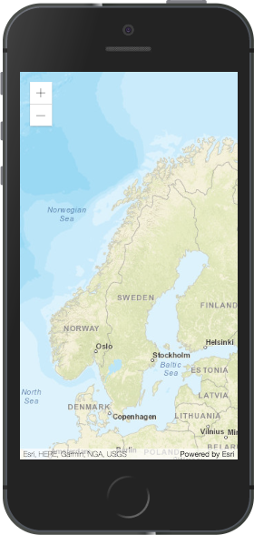

<!-- .slide: data-background="../reveal.js/img/title.png" class="center" -->

#Tips and Tricks for Developing and Debugging Apps

Heather Gonzago and Kelly Hutchins

---

# Overview

- Setting up your dev environment
- Dev tools intro 
- Common gotchas
- Dev tools tips

---

# Code Editor or IDE

- Syntax highlighting
- Code Hinting
- Git integration
- Theming
- Task integration

[Demo](https://www.slant.co/topics/1686/~javascript-ides-or-editors)

---

# Extensions

- Beautify
- JSLint or JSHint 
- Code hinting

[JSAPI Resources](https://github.com/Esri/jsapi-resources)

---

# Dev Tools Intro
  
  Browser based tools to track down issues, inspect css, analyze performance and more. 

    - Firefox Developer Edition
    - Chrome and/or Chrome Canary
    - Edge 
    - Safari
    
---

# Dev Tools 

    - Console
    - Debugging
    - Network traffic
    - Css inspection 
    ... and much more

---

# Gotchas

[Demo](demos/index.html)

---

# Console
 
 - Log diagnostic info
 - Enter commands

```js
    require([
      "esri/geometry/support/webMercatorUtils"
    ], function(webMercatorUtils) {
       var extent = this.view.extent;
       var geoExtent = webMercatorUtils.webMercatorToGeographic(extent);
        console.log(JSON.stringify(geoExtent));
    });
```

[Console demo](demos/dev-tols-demos/console.html)

---

# Network

- Inspect network traffic 

[Network demo](https://developers.arcgis.com/javascript/latest/sample-code/widgets-search-3d/live/index.html)

---

# Network: Copy Image

- Copy as Data URI (base64 encoded)

[Copy image](http://www.arcgis.com/features/index.html)


---

# Debugging

- Breakpoints

[Debugging demo](https://developers.arcgis.com/javascript/latest/sample-code/widgets-search-3d/live/index.html)


---


# CSS

- View and edit css 

[CSS](https://developers.arcgis.com/javascript/)


---

# Application

- Cookies
- Local Storage
- App Cache 


[Resources](http://html5demos.com/storage)

---

# Responsive

- Emulate 
- Geolocation and touch overrides 
- Debug remotely


[Resources](http://html5demos.com/storage)

---

# Screen Capture

- Firefox and Chrome 
- Device mode (Show device frame and capture screenshot)



---

# Links

- [Developer Help](https://developers.arcgis.com/javascript/)

---

# Questions??

---

# Please take our survey
1. Download the Esri Events app and go to DevSummit
2. Select the session you attended
3. Scroll down to the "Feedback" section
4. Complete Answers, add a Comment, and Select "Submit"


---

<!-- .slide: data-background="../reveal.js/img/end.png" -->