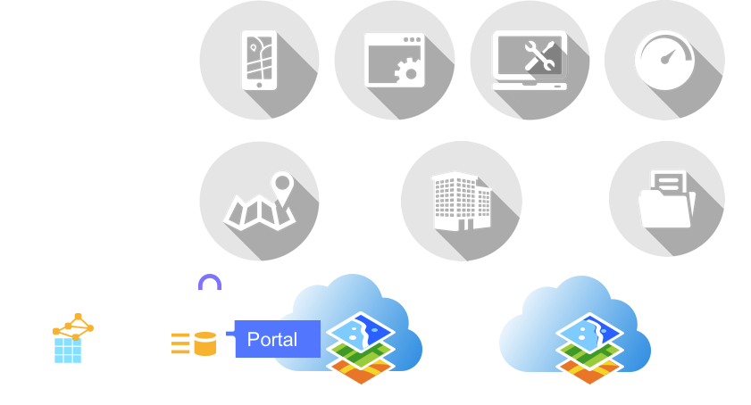
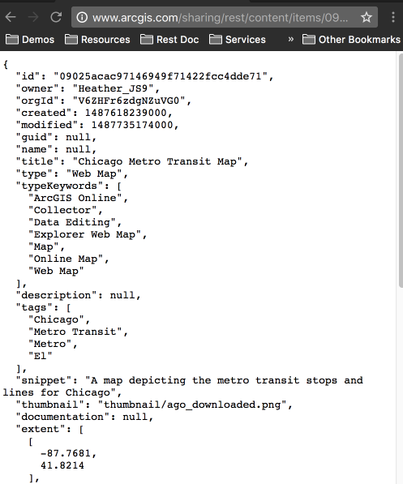
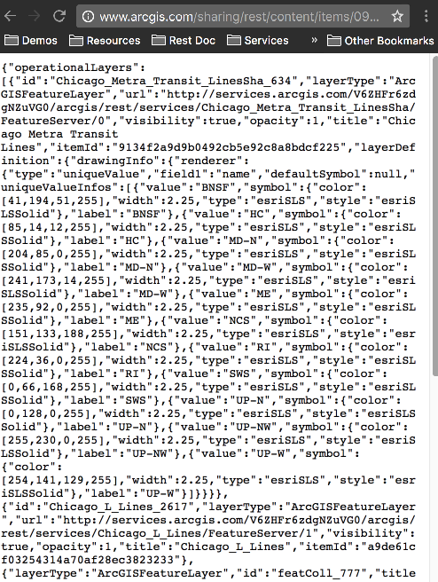
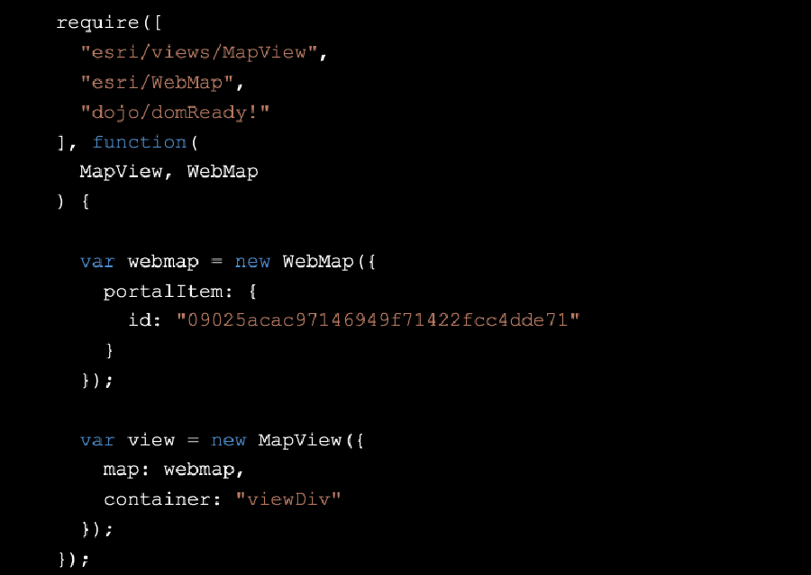

<!-- .slide: data-background="../reveal.js/img/title.png" -->
<!-- .slide: class="title" -->
# Building Web Apps that Integrate with Your Portal
Bjorn Svensson and Heather Gonzago

---

## **Agenda**
 - Types of apps
 - Traditional token-based authentication
 - OAuth2 authentication
 - User login authentication
 - Application authentication
 - Resource proxy
 - ArcGIS Online hosted proxy
 
---

## **Architecture: Apps + Content**

 
 
---

## **Web Maps**

 

---

## **Web Scene**

---

## **ID: Unique Identifier**

Note:
ArcGIS Based services. User logins, you write the app, and the application is responsible for accessing the credentials from the user and keeping these credentials safe.

---

## **Web map & scenes: JSON information & data **

Note:
Web maps are defined in JSON, a text format that can be easily transferred and stored.  A web map is compose of two sets of information. The item information which contains details about the web map like title, description, author etc. The other portion is the web map data which describes the map contents like layers, popup info, extent, symbology, bookmarks and more. Visit the web map specification for more details about the components of a web map. 

Show examples: 
Web map: 
http://jsapi.maps.arcgis.com/home/webmap/viewer.html?webmap=09025acac97146949f71422fcc4dde71

Item details
http://www.arcgis.com/sharing/rest/content/items/09025acac97146949f71422fcc4dde71?f=pjson

Item Info
http://www.arcgis.com/sharing/rest/content/items/09025acac97146949f71422fcc4dde71/data?f=pjson

---

## **Advantages of using web maps/scenes**
- Easy to leverage
- Content for Web App Templates, Web App Builder and Native Apps
- Supported by mobile device SDKs and web APIs
- Discoverable 
- Less code
- Reusable
- Organize/Update content centrally without updating apps

---

## **Demo: ArcGIS Online and Portal 2D Maps & Apps**

---

## **Working with web maps**

---

<!-- .slide: data-background="../../reveal.js/img/bg-5.png" -->
## **Demo: Register your app**

---

<!-- .slide: data-background="../../reveal.js/img/bg-5.png" -->
## **Agenda**
- Types of apps
- Traditional token-based authentication
- OAuth2 authentication
- User login authentication
- Application authentication
- Resource proxy
- ArcGIS Online hosted proxy

---

<!-- .slide: data-background="../../reveal.js/img/bg-5.png" -->
## **OAuth2: User login authentication**

- Works with named users
- Server-side login page
- Provides single sign-on
  - If already in active portal session,  
  user is not required to enter credentials again
  - Approval screen to grant access to the app

---

<!-- .slide: data-background="../../reveal.js/img/bg-5.png" -->
## **OAuth2: Typical user login workflows**
 - Working with browser-based or mobile applications?
   - 1-step workflow, i.e. Implicit Grant

 - Desktop, mobile, or server-side web application?
  - 2-step workflow, i.e. Authorization Grant

---

<!-- .slide: data-background="../../reveal.js/img/bg-5.png" -->
## **OAuth2: 1 step user-login workflow**

  1. App directs user to `/authorize` endpoint
  2. Valid user/pass?
  3. Redirect back to app at provided `redirect_uri`
  4. `access_token` is included with the response
  5. [App can parse the URL for token use](https://developers.arcgis.com/authentication/browser-based-user-logins/#parse-the-token-from-the-url)

---

<!-- .slide: data-background="../../reveal.js/img/bg-5.png" -->
## **OAuth2: Identity Manager**
- Client SDKS provide OAuth2 functionality via the Identity Manager
- Handles the complexity of calling endpoints and parsing tokens
- Example: JS API Identity Manager
  - `OAuthInfo` class -> pass in registered `App ID`
  - Pass this information to the Identity Manager

---

<!-- .slide: data-background="../../reveal.js/img/bg-5.png" -->
## **Demo: OAuth2 login**

---

<!-- .slide: data-background="../../reveal.js/img/bg-5.png" -->
## **OAuth2: 2 step user-login workflow**

---

<!-- .slide: data-background="../../reveal.js/img/bg-5.png" -->
## **2 step: Get authorization code**

---

<!-- .slide: data-background="../../reveal.js/img/bg-5.png" -->
## **2 step: Auth code sent to Server (redirect uri)**

---

<!-- .slide: data-background="../../reveal.js/img/bg-5.png" -->
## **2 step: Request Tokens (Access + Refresh)**

---

<!-- .slide: data-background="../../reveal.js/img/bg-5.png" -->
## **2 step: Redirect to Callback with Tokens**

---

<!-- .slide: data-background="../../reveal.js/img/bg-5.png" -->
## **2 step: Save Refresh Token on Server**

---

<!-- .slide: data-background="../../reveal.js/img/bg-5.png" -->
## **2 step: Trusted Server Connection:** 
## **Obtain info about user**

---

<!-- .slide: data-background="../../reveal.js/img/bg-5.png" -->
## **2 step: App config based on user/role**

---

<!-- .slide: data-background="../../reveal.js/img/bg-5.png" -->
## **2 step: Access secured ArcGIS Server services:** 
## **(based on user/role)**

---

<!-- .slide: data-background="../../reveal.js/img/bg-5.png" -->
## **2 step: Send Token to Client App**

---

<!-- .slide: data-background="../../reveal.js/img/bg-5.png" -->
## **2 step: Request Asset Again & Authorize**

---

<!-- .slide: data-background="../../reveal.js/img/bg-5.png" -->
## **Enterprise logins**

- Login to ArcGIS Online using your enterprise login (Active Directory, LDAP, …)
- Uses the SAML standard
- [Setting up Enterprise Logins](http://doc.arcgis.com/en/arcgis-online/administer/enterprise-logins.htm)
 
- Nothing changes for the App Developer
  - Use standard OAuth workflow (redirect user to /authorize URL as usual)
  - Portal detects enterprise login if configured for the organization
  - Redirects user to their enterprise provider
  - Enterprise redirects user to portal upon login
  - Portal generates token and sends it to the app

---

<!-- .slide: data-background="../../reveal.js/img/bg-5.png" -->
## **Agenda**
 - Types of apps
 - Traditional token-based authentication
 - OAuth2 authentication
 - User login authentication
 - Application authentication
 - Resource proxy
 - ArcGIS Online hosted proxy

---

<!-- .slide: data-background="../../reveal.js/img/bg-5.png" -->
## **OAuth2: application authentication**

- When would you want to use app authentication?
 Do not want users to have to log in to access application and/or content. 
- Access the following services:
 - Geocoding
 - Routing and Directions
 - Demographic Data (GeoEnrichment)
 - Esri Geotrigger Service
 - Esri Premium Maps and Layers which require a subscription.
 - Elevation Analysis

---

<!-- .slide: data-background="../../reveal.js/img/bg-5.png" -->
## **OAuth2: application authentication**

- Users of the App are unknown to the ArcGIS platform
- No login prompts
- App logs in to the ArcGIS platform on behalf of itself
- App must contain valid app credentials
- Proxy is responsible for keeping the app secret secure

---

<!-- .slide: data-background="../../reveal.js/img/bg-5.png" -->
## **OAuth2: app authentication workflow**

  1. App makes POST to `/token` endpoint 
  with `client_id`   and `/client_secret`   with `grant_type=client_credentials`

  2. `Access_token` in JSON response

  3. Parse token and use in requests as needed

---

<!-- .slide: data-background="../../reveal.js/img/bg-5.png" -->
## **Limitations with app authentication**

- Applications can only read or query private data content.
- Cannot modify, upload, create, or delete content.
- Cannot list applications in ArcGIS Marketplace. 

---

<!-- .slide: data-background="../../reveal.js/img/bg-5.png" -->
## **App logins: proxy steps**

1. Register app
2. Configure proxy with app credentials
3. Proxy uses app credentials to get app token from the portal
4. Front-end app calls into the proxy
5. Proxy uses app token to call into secured portal resources
6. Proxy returns results to the app

---

<!-- .slide: data-background="../../reveal.js/img/bg-2.png" -->
## **Demo: app authentication**

---

<!-- .slide: data-background="../../reveal.js/img/bg-5.png" -->
## **OAuth2: Security with application authentication**
- Never expose client_secret
- Keep secure server-side in proxy
- Rate limiting against server-based misuse

---

<!-- .slide: data-background="../../reveal.js/img/bg-5.png" -->
## **Updated proxy files**

- [https://github.com/Esri/resource-proxy](https://github.com/Esri/resource-proxy)
- DotNet, JSP, and PHP
- Access resources secured with token-based authentication, i.e. premium credit-based services
- Resource and referer-based rate limiting
- Access cross domain resources
- Enabled logging

---

<!-- .slide: data-background="../../reveal.js/img/bg-5.png" -->
## **Proxies**

- Install proxy based on README.md file
- Can also use token based authentication in addition to OAuth2
- Locking it down by referrer: Only requests coming from listed referrers are proxies
- Rate limits
  - rateLimitPeriod: The time period (in minutes) which the rateLimit is tracked.
  - rateLimit: Maximum number of requests for a specific referer over the given rateLimitPeriod.

---

<!-- .slide: data-background="../../reveal.js/img/bg-5.png" -->
## **Agenda**
 - Types of apps
 - Traditional token-based authentication
 - OAuth2 authentication
 - User login authentication
 - Application authentication
 - Resource proxy
 - ArcGIS Online hosted proxy

---

<!-- .slide: data-background="../../reveal.js/img/bg-5.png" -->
## **ArcGIS Online hosted proxy**

- Esri maintained server-side proxy service
- Allows access to a secured AGO service 
- Token is not stored with the client app
- The proxy service also supports a whitelist based on the HTTP Referer header 
- Supports service rate limiting

---

<!-- .slide: data-background="../../reveal.js/img/bg-5.png" -->
## **Configure AGO hosted proxy**

---

 <!-- .slide: data-background="../../reveal.js/img/bg-5.png" -->
## Conclusion

- Use OAuth2 for user logins
- Benefits include usage tracking, enterprise logins, etc.
- Identity Manager simplifies login workflow in client SDKs
- [https://developers.arcgis.com/authentication](https://developers.arcgis.com/authentication) for additional information.

---

 <!-- .slide: data-background="../../reveal.js/img/bg-5.png" -->
# Questions

---
