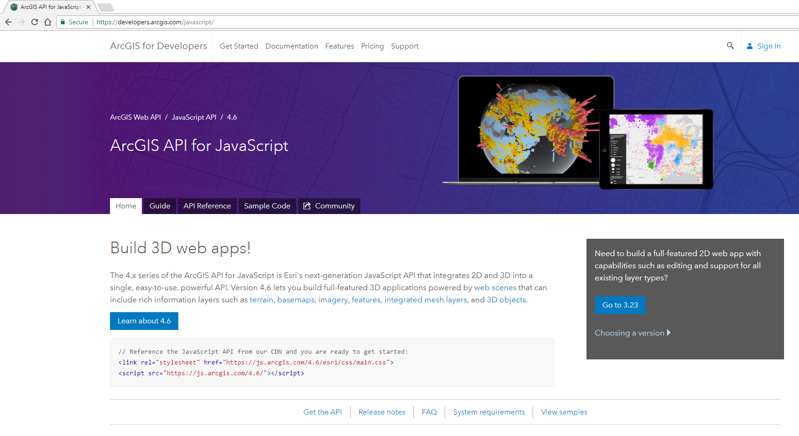
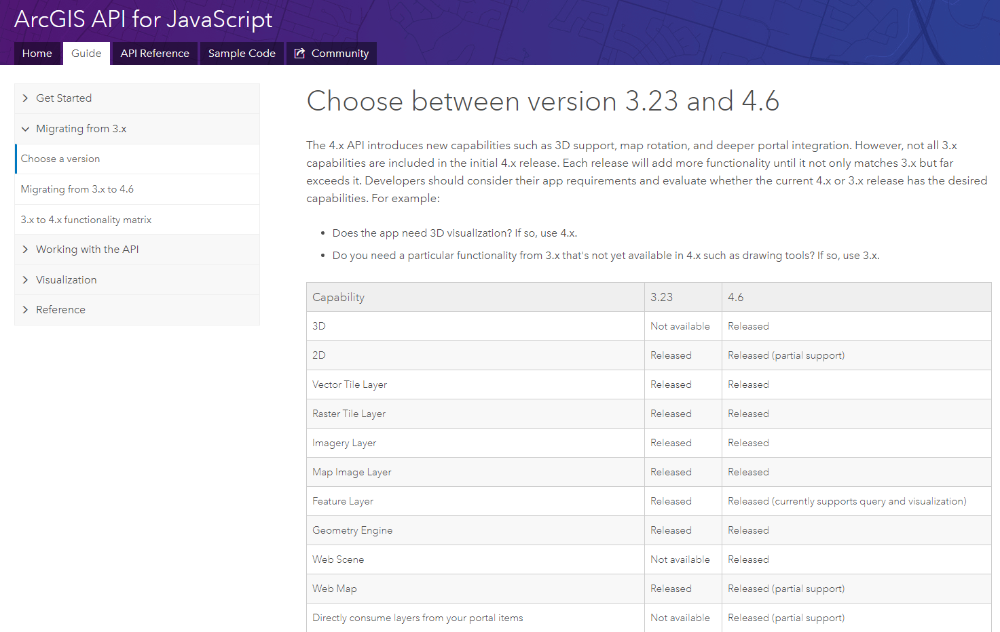
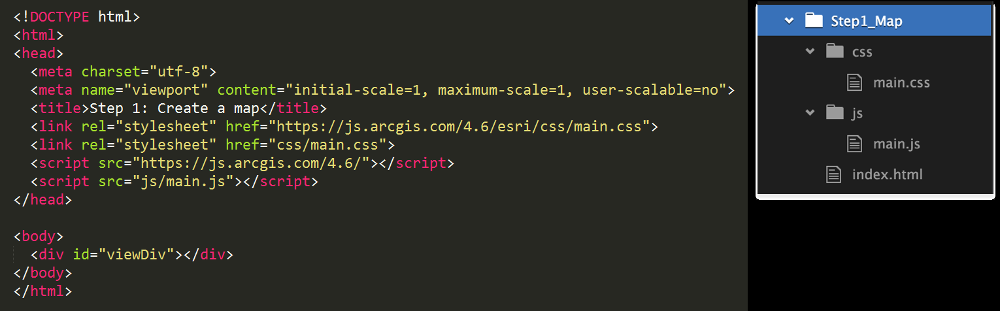
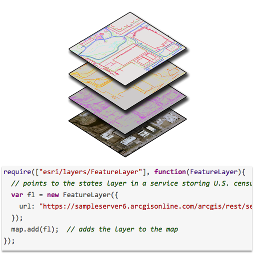
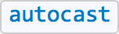
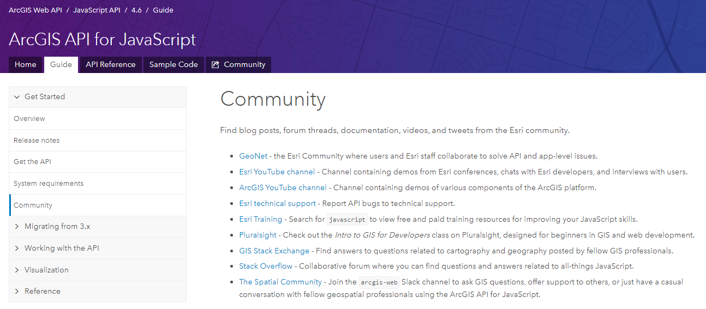
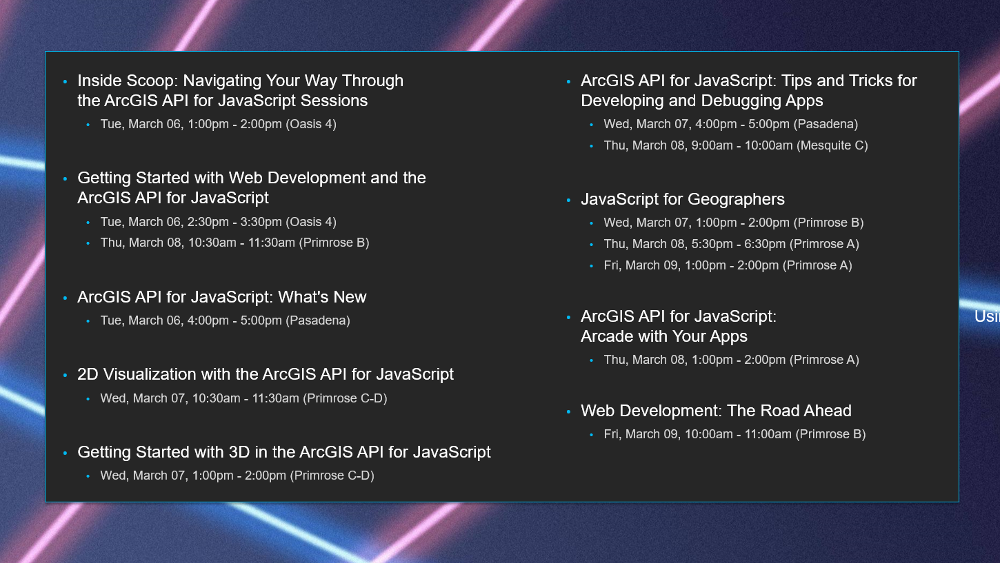
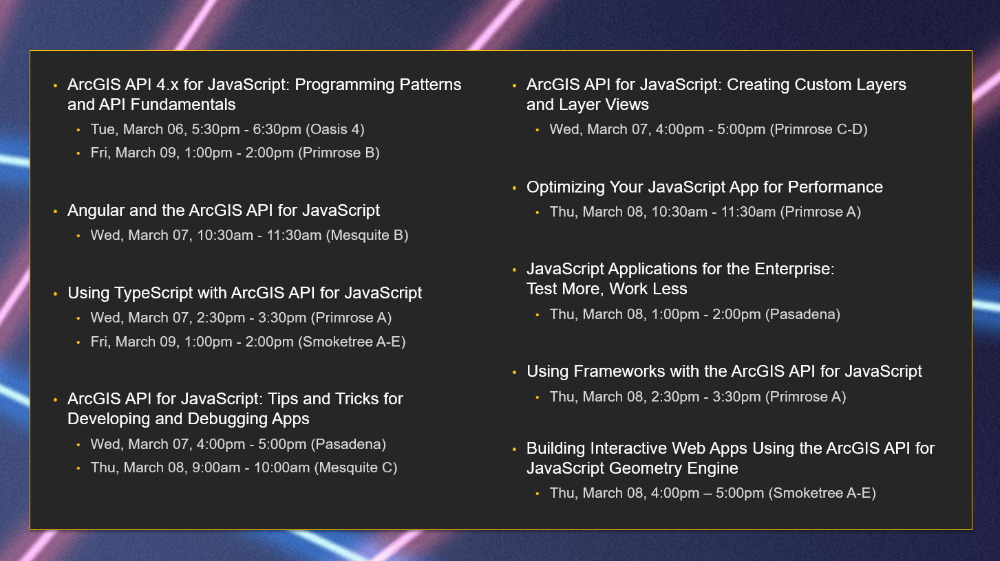

<!-- .slide: data-background="../reveal.js/img/bg-1.png" -->
<!-- .slide: class="title" -->
 
 
 
### Getting Started with Web Development 
### and the ArcGIS API for JavaScript
 
Heather Gonzago and Noah Sager

---

### **Agenda**
 - Setup
 - First steps
 - Working with layers
 - Symbols and renderers
 - Make the map interactive
 - Widgets

---

### **Presentations accessible via GitHub**
   
  - This session focuses on version 4.x 
   
  - Concepts remain similar between versions 3.x and 4.x 
   
  - <a href="https://github.com/hgonzago/DevSummit-presentations" target="_blank">https://github.com/hgonzago/DevSummit-presentations</a>

---

### **Where do I begin?**

---

### **Which version of the API is best?**

---

### **Developer Setup**

---

### **JSAPI Resources**

 - Includes
   - JSHint file
   - TypeScript definition file
   - Build tools, e.g. Bower
   - OAuth popup callback

---

### **Get the API**
 - <a href="https://developers.arcgis.com/javascript/latest/guide/get-api/index.html#cdn" target="_blank">CDN</a>
 - Custom builds
 - <a href="https://developers.arcgis.com/downloads/" target="_blank">Download builds</a>
 
 
 <pre><code data-trim>
&lt;link rel=&quot;stylesheet&quot; href=&quot;https://js.arcgis.com/4.6/esri/css/main.css&quot;&gt; 
&lt;script src=&quot;https://js.arcgis.com/4.6/&quot;&gt;&lt;/script&gt;
</code></pre>

---

### CSS
- <a href="https://developers.arcgis.com/javascript/latest/guide/styling/index.html" target="_blank"><b>Main.css</b></a> contains styles for entire API
   <pre><code data-trim>
   &lt;link rel=&quot;stylesheet&quot; href=&quot;https://js.arcgis.com/4.6/esri/css/main.css&quot;&gt;
   </code></pre>
- <b>View.css</b> is smaller in size but better choice if only needing basic CSS (maps, widgets, etc.)
  <pre><code data-trim>
   &lt;link rel=&quot;stylesheet&quot; href=&quot;https://js.arcgis.com/4.6/esri/css/view.css&quot;&gt;
   </code></pre>
- Themes
    <pre><code data-trim>
   &lt;link rel=&quot;stylesheet&quot; href=&quot;https://js.arcgis.com/4.6/esri/themes/theme-name/main.css&quot;&gt;
   </code></pre>
- Custom CSS (SASS)

---

### **First steps**
- How will app be written?
- Separate files or one combined file?

---

### **Demo: Make a map**

Add picture of adding map

---

### **MapView**

Visualize data within Map or Scene
<pre><code data-trim>
var view = new MapView({
  container: "viewDiv",
  map: map,
  zoom: 12,
  center: [-117.168, 32.776]
});
</code></pre>
<pre><code data-trim>
var view = new SceneView({
  container: "viewDiv",
  map: map,
  camera: {
    heading: 210,
    tilt: 78,
    position: {
      x: -8249335,
      y: 4832005,
      z: 50.7,
      spatialReference: {
        wkid: 3857
      }
    }
  }
});
</code></pre>

---

### **Add layers**

 - <a href="https://developers.arcgis.com/javascript/latest/api-reference/index.html#modules-in-esri-layers" target="_blank">Various layer types</a>
1. Load module  
2. Create layers  
3. Set properties  
4. Add to map or scene 
 
 - Basic steps remain the same

---

### **Properties**
- No need for a bunch of get/set statements
<pre style="display:inline-block; padding: 5px; margin: 10px auto; width: 50%;"><code data-trim> 
var map = new Map();
map.basemap = "streets";
map.ground = "world-elevation";
var view = new MapView();
view.center = [-100, 40];
view.zoom = 6;
</code></pre>
- <a href="https://developers.arcgis.com/javascript/latest/guide/working-with-props/index.html" target="_blank">Properties</a> can be set in constructor
<pre style="display:inline-block; padding: 5px; margin: 10px auto; width: 50%;"><code data-trim> 
var map = new Map({
    basemap: "streets",
    ground: "world-elevation"
});
var view = new MapView({
    map: map, 
    center: [-100, 40], 
    zoom: 6
  });
</code></pre>
---

### **Watch for property changes**
- <a href="https://developers.arcgis.com/javascript/latest/api-reference/esri-core-Accessor.html#watch" target="_blank">Watch</a> for changes  
<pre style="display:inline-block; padding: 5px; margin: 10px auto; width: 99%;"><code data-trim>
layer.watch("loadStatus", function(status) {// do something});
</code></pre> 
 
- Can also use <a href="https://developers.arcgis.com/javascript/beta/api-reference/esri-core-watchUtils.html" target="_blank">esri/core/watchUtils</a> utility methods 
 
- See this in action with the <a href="https://developers.arcgis.com/javascript/latest/sample-code/watch-for-changes/index.html" target="_blank">Watch for Changes</a> sample
---

### **Demo: Add layer to sample app**

Add pic of demo with layers and link to it

---

### **Renderers**
- <a href="https://developers.arcgis.com/javascript/latest/sample-code/get-started-visualization/index.html" target="_blank">Define</a> a set of symbols to use for the layer 
 
- Sets the rules on how the symbols are used 
 
- Basic coding pattern
<pre style="display:inline-block; padding: 5px; margin: 10px auto; width: 99%;"><code data-trim>
var layerRenderer = new UniqueValueRenderer(); // Set the renderer
var featurelayer = new FeatureLayer({
    url: "featurelayer url",
    renderer: layerRenderer // pass in renderer to featurelayer using default properties
})
</code></pre>

---

### **Symbols**
- Renderers use symbology, e.g. points, lines, polygons 
 
- Set the renderer's symbol
<pre style="display:inline-block; padding: 5px; margin: 10px auto; width: 75%;"><code data-trim>
var symbol = new SimpleMarkerSymbol({
    // set the properties
});
</code></pre>
<pre style="display:inline-block; padding: 5px; margin: 10px auto; width: 75%;"><code data-trim>
var renderer = new UniqueValueRenderer({
    defaultSymbol: symbol, // set symbol for renderer
    // provide anymore properties necessary
});
</code></pre>

---

### **Autocasting**
 
- No need to <b>Require()</b> the module 
 
- Look for the  label in SDK's API Reference 
 
- <a href="https://developers.arcgis.com/javascript/latest/sample-code/sandbox/index.html?sample=layers-portal" target="_blank">Create a layer from portal item sample </a> shows autocasting in action 
 
- Read more about <a href="https://developers.arcgis.com/javascript/latest/guide/autocasting/index.html" target="_blank">Autocasting</a> in the Guide 

---

### **Demo: Update a feature layer's renderer**
Add picture of demo

---

### **Map interaction using popups**
- Responds to mouse clicks
- Provides info on
  - feature attributes
  - location
  - search results
- Customizable

Add pic of popup from demo

---

### **PopupTemplate**
- View has associated popup, can set content here
- FeatureLayer has associated <a href="https://developers.arcgis.com/javascript/latest/api-reference/esri-PopupTemplate.html" target="_blank">popupTemplate</a> property
- Position the popup using *dockOptions*
<pre style="display:inline-block; padding: 5px; margin: 10px auto; width: 75%;"><code data-trim>
var popupTemplate = new PopupTemplate({
    title: "Title of the popup",
    content: [{
      // Set the content here
    }]
});
</code></pre>
<pre style="display:inline-block; padding: 5px; margin: 10px auto; width: 75%;"><code data-trim>
var featurelayer = new FeatureLayer({
    url: "url to the feature layer",
    outFields: ["*"],
    popupTemplate: popupTemplate,
    renderer: renderer
});
</code></pre>

---

### **Demo: Add a popup to the map**

Add a picture of the demo with the popup

---

### **Using web maps**

- Reduces coding effort 
 
- Retains all customizations with rendering, popups, etc. 
<pre style="display:inline-block; padding: 5px; margin: 10px auto; width: 99%;"><code data-trim>
var map = new WebMap({
    portalItem: {
      id: "8444e275037549c1acab02d2626daaee" // Remember portalItem is autocasted
    }
});
</code></pre>

---

### **Demo: Add a web map to an application**

Show pic of demo app with link to it

---

### **Widgets**

- Encapsulates functionality
- Similar coding pattern
<pre style="display:inline-block; padding: 5px; margin: 10px auto; width: 99%;"><code data-trim>
view.when(function){
    var featurelayer = map.layers.getItemAt(1);
    // 1. Create the widget
    var legend = new Legend({
      // 2. Specify properties for widget
      view: view,
      layerInfos: [{
          layer: featurelayer,
          title: "Name"
      }]
  });
    // 3. Add widget to the view UI
    view.ui.add(legend, "bottom-left");
});
</code></pre>

---

### **Demo: Add the Search widget to the application**

Add picture of the demo with link

---

### **Where can I get more info?**

- SDK Documentation
- Esri-related training and webinars
- JavaScript online training, free and not-so-free
- User forums, e.g. GeoNet, StackExchange, Spatial Community in Slack, etc. 
 
<a href="https://developers.arcgis.com/javascript/latest/guide/community/index.html" target="_blank">

---

### **Additional Sessions (Introduction)**

<a>

---

### **Additional Sessions (Advanced)**

<a>

---

### **Survey??**

do we have a survey slide?

---

 <!-- .slide: data-background="../../reveal.js/img/bg-final.jpg" -->
## Thank you

---

