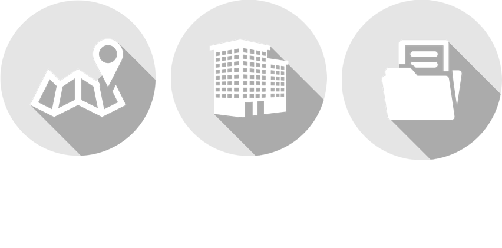
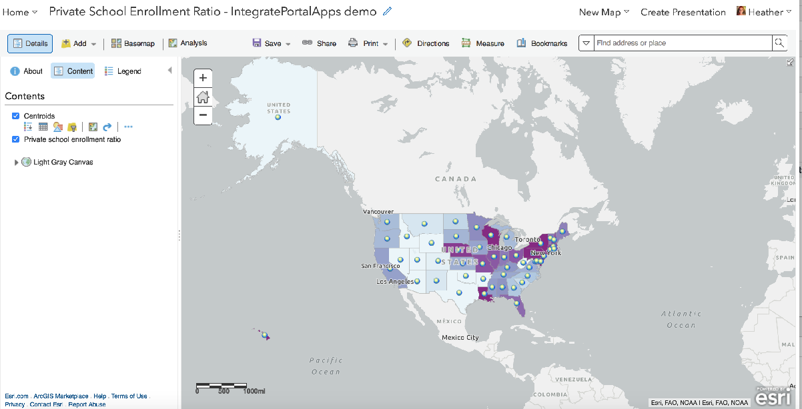
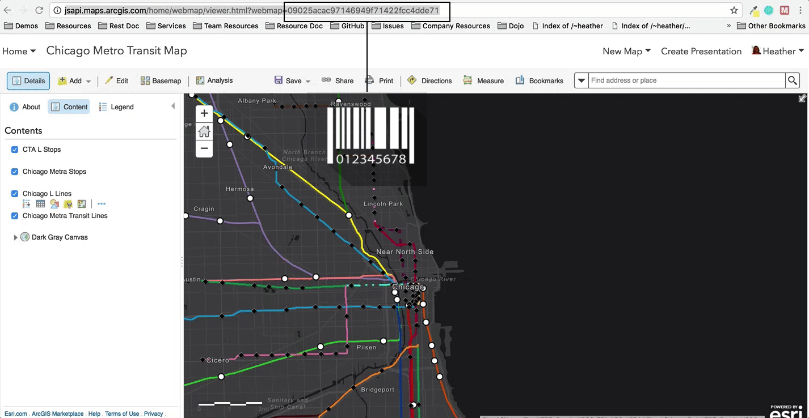
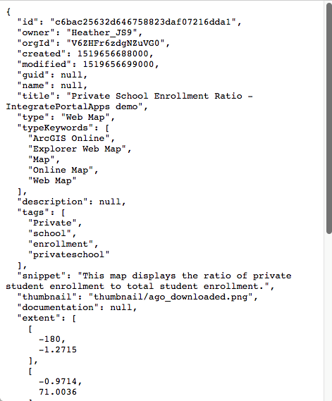
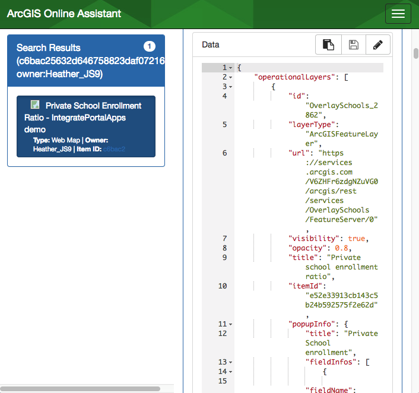
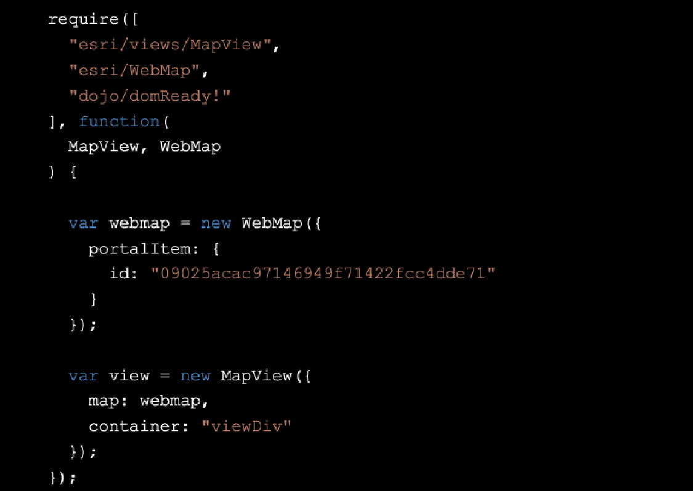
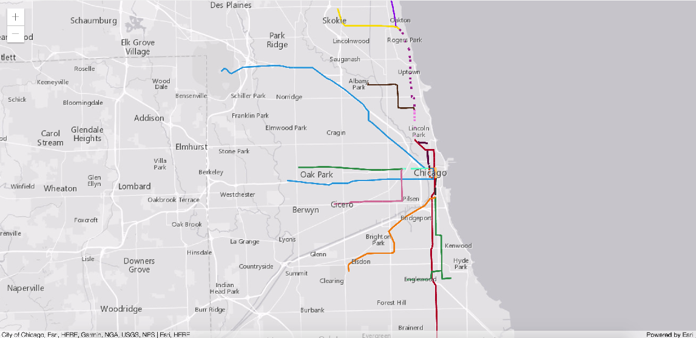
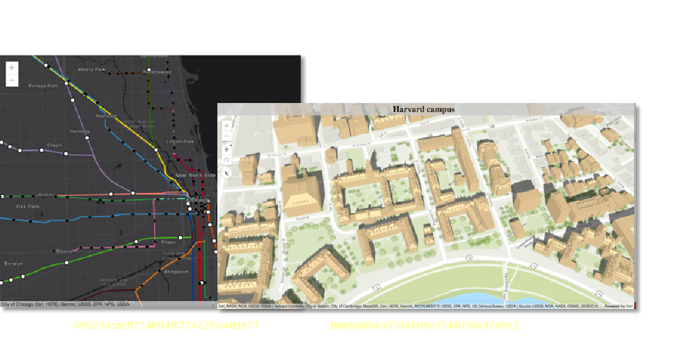

<!-- .slide: data-background="../reveal.js/img/bg-1.png" -->
<!-- .slide: class="title" -->
 
 
 
### Building Web Apps that Integrate with Your Portal
 
 Heather Gonzago and Kelly Hutchins

---

### **Agenda**

* General AGO/Portal overview
* Inside web map/scenes
* Adding ArcGIS Online content to a JavaScript application
* Working with secured ArcGIS Online items in a JavaScript application

---

### **Advantages of working with AGO/Portal**

 

- Sharing and managing secure resources
- Data hosting
- Easy to leverage
- Less code
- Reusable
- Organize/Update content centrally 

----

### **Architecture: Apps + Content**

 

----

### **Content: Basic building block for Apps**
 

----

### **Web Maps**

----

### **Web Scene**

----

### **ID: Unique Identifier**

----

### **Web map & scenes: JSON information & data**
 

----

### **Demo: Inside the web map**

----

### **Access a web map in an application**

 

----

### **Access individual layer items**

* 4.x provides support for adding individual portal items into web application
* Call `Layer.fromPortalItem` and pass in the unique id layer item

----

### **Demo**

Create application referencing <code>portalItem</code>

----

### **Portal API**

----

### **WebMap and Portal classes**

- esri/WebMap
- esri/WebScene
- esri/Portal
  - Portal
  - PortalFolder
  - PortalGroup
  - [PortalItem](https://developers.arcgis.com/javascript/latest/api-reference/esri-portal-PortalItem.html)
  - PortalQueryParams
  - PortalQueryResult
  - PortalRating
  - PortalUser

----

### **Demo: Portal Rest API via `esriRequest` and API `PortalQueryParams` class**

----

### **Access secure content**

- Handles security so no need to write a bunch of code
- Detects private (unshared) data automatically
- If private, prompts for credentials
  - log-in via Identity Manager dialog prompt or
  - use the platform's provided OAuth framework to handle it for you

----
### **Benefits of using the platform security model**

- The web application does not have direct access to credentials
- Support for enterprise logins
- No need to sign in every time calls are made to a secure service
- Can track how the app is being used
- Easy to access resources secured with token-based authentication, e.g. premium credit-based services

----

### **Demo: Access private data in a web application**

----

### **Demo: Register an application for Oauth use**

----

### **Access credit-based services**

- Let the application handle this for you, no need to sign in to gain access
- Proxy file with saved credentials
  - Hosted proxy file provided by Esri OR
  - Host your own proxy file
  - One is provided by Esri at https://github.com/Esri/resource-proxy
  - Provided in DotNet, JSP, and PHP
  
----
### **Support for saving web scene**

----

### **Demo: Save a web scene**

----

## **Questions ????**

----

## Please take our survey
1. Download the Esri Events app and go to DevSummit
2. Select the session you attended
3. Scroll down to the "Feedback" section
4. Complete Answers, add a Comment, and Select "Submit"

----

<!--.slide: data-background="../reveal.js/img/end.png" -->

----
