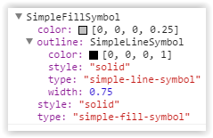

Custom ArcGIS API 4 for JavaScript object formatting for Chrome DevTools.
---

Chrome DevTools provides an option to take control over how objects are formatted in DevTools.
More info: https://docs.google.com/document/d/1FTascZXT9cxfetuPRT2eXPQKXui4nWFivUnS_335T3U/preview?pref=2&pli=1

These formatters display public properties from objects produced by the [ArcGIS API 4 for JavaScript](https://js.arcgis.com).

Example of an `esri/Map` default console formatting:  


Example of an `esri/Map` custom console formatting:  


Example of an `esri/symbols/SimpleFillSymbol` custom console formatting:  



Usage
---

#### Enable custom formatters in Chrome Devtools

Open the Chrome DevTools settings page and check the option _"Enable custom formatters"_


#### Import and install the devtools formatters

Require the appropriate module and invoke `install()` to enable the formatter.

```js
require({
  packages: [
    { name: "arcgis-devtools", location: "https://rawgit.com/ycabon/arcgis-js-api-devtools/master/dist" }
  ]
}, [
  "arcgis-devtools",

  "esri/Map"
], function(
  arcgisDevtools,
  Map
) {
  arcgisDevtools.install();

  var map = new Map({
    basemap: "dark-gray",
    ground: "world-elevation"
  });

  console.log(map);
});
```
