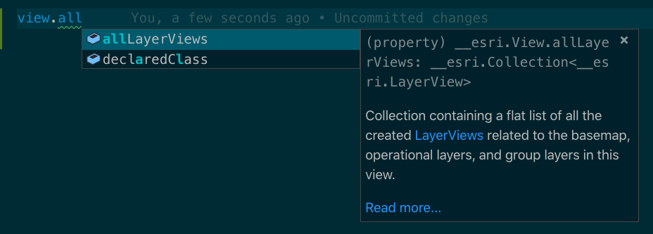
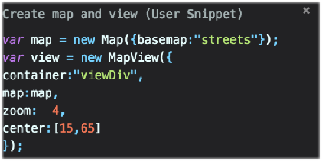
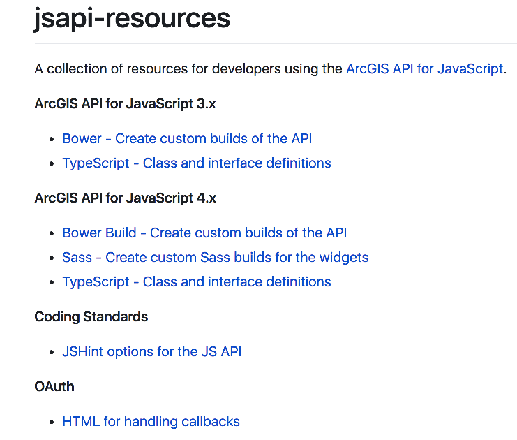
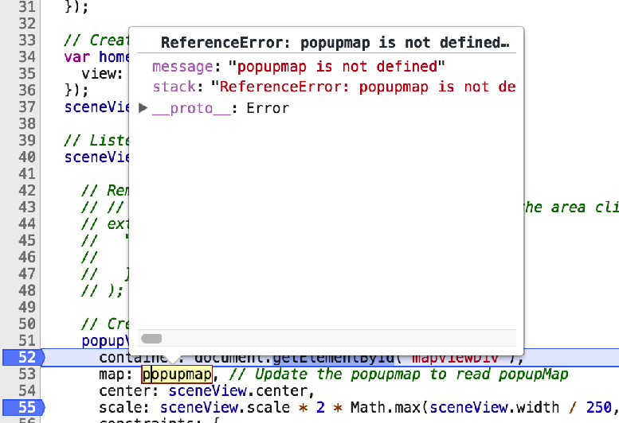
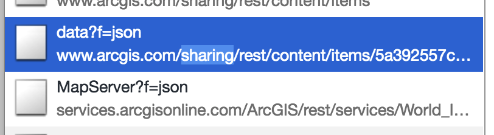
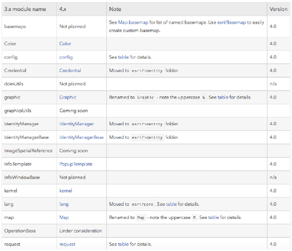
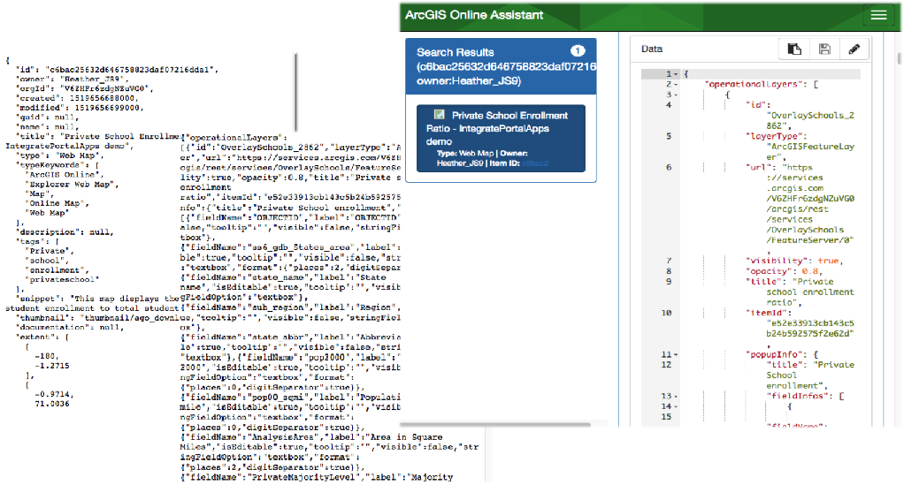

<!-- .slide: data-background="../reveal.js/img/bg-1.png" -->
<!-- .slide: class="title" -->
 
 
## Tips and Tricks for Developing and Debugging Apps
Kelly Hutchins and Heather Gonzago

----

### **Overview**
 

- Setting up your dev environment
- JSAPI resources and tips
- Browser tips and tools
- … and more

----

<!-- .slide: data-background="../reveal.js/img/bg-3.png" -->
  
## **Dev environment setup**

----

### **Local web server**

 

- Visit [http://localhost](http://localhost)
- Setup IIS or Apache
- Lightweight http server
- http-server
- Express
- Browser extensions

----

### **Code Assist**
 

- TypeScript
- JS using Babel

----

### **Emmet**
 
  

- Save keystrokes
- HTML, CSS abbreviations
- [Plug-in page](https://emmet.io/download/)

----

### **Snippets**
 

- Templates for common code
- Generate for VSCode, Sublime, Atom
- [Snippet generator](https://pawelgrzybek.com/snippet-generator/)
- Extensions for IDE to simplify

----

### **JSAPI Resources**

 

- JSHint file
- TypeScript definition file
- Build tools, e.g. Bower
- OAuth Callback

----
### **Other useful resources**

- Rene's blog
- Raluca's samples
- Arcade example repo

----
<!-- .slide: data-background="../reveal.js/img/bg-3.png" -->
  
## **Browser Dev Tools**

----

### **Browser Extensions **

- WhatFont
- JSON Viewer
- JavaScript and CSS Code Beautifier
- Awesome autocomplete for GitHub
- Wappalyzer
- Quick source viewer
- The list goes on and on …

----

### **Console:  Messages**

View console messages from JSAPI

----
### **Debugging:  Breakpoints**

 

 
  

- Various ways to pause code (XHR, DOM etc)
- Debugger;
- Blackboxing

----

### ** Debugging: Network requests**

 

- Records all network requests
- Helps in troubleshooting, e.g.
  - Printing issues
  - Queries

----
### **Debugging:  CSS Inspection**

Inspect iem to find info about:

- CSS class names
- Applied styles
- Color contrast
- Toggle pseudo element

----

### **Other stuff**

 

 

- Mobile emulation
- Throttling
- Sensors - geolocation

----

### **Accessibility**

- Audits
- Color Contrast
- Extensions
- Axe Coconut (similar to Chrome Canary or Firefox nightly)
- Axe a11y extension
- ChromeVox screen reader

----

<!-- .slide: data-background="../reveal.js/img/bg-3.png" -->
  
## **JSAPI Specific **

----
### **Release Notes**

- Release notes and breaking changes
----
### **Reading the doc**

Understanding the API REF
Deep dive into the api ref and what things mean

- require statement
- beta tag  ???
- Since:
- Autocast
- Hide/show inherited properties
- See also: Samples and additional info
- For widgets look at scss and view model

----

### **3.x to 4.x Feature Matrix**

- Is this functionality in 4.x?
- 4.x equivalency in 3.x?

----
### **Module Order**

Order matters - add example here showing module order

----

### **Mixed Content**

- Mixed content errors http/https
- CORS/Proxy

----

### **Autocast **

 
When to autocast vs when to load module

----
### **Extent changed **

 
- <a href="https://community.esri.com/thread/207901-in-4x-how-to-catch-extent-change-event" target="_blank">4.x extent changed event</a>

<pre style="display:inline-block; padding: 5px; margin: 10px auto; width: 75%;"><code data-trim>
watchUtils.whenFalse(view, 'stationary', function(evt){
  if(!view.stationary){
    watchUtils.whenTrueOnce(view, 'stationary', function(evt){
      console.log(view.extent);
    });
   }
   else {
     watchUtils.whenFalseOnce(view, 'interacting', function(evt){
       console.log(view.extent);
     });
   }
})
</code></pre>

----
### **Troubleshooting Tips**

- Narrow the problem down
  - App specific
  - API specific
  - Server-side issue
  - Are any 3rd party resources involved?

----

### **Ago Assistant**

----

<!-- .slide: data-background="../reveal.js/img/bg-final.jpg" -->

## Questions?

**Help us to improve** by filling out the survey

----
