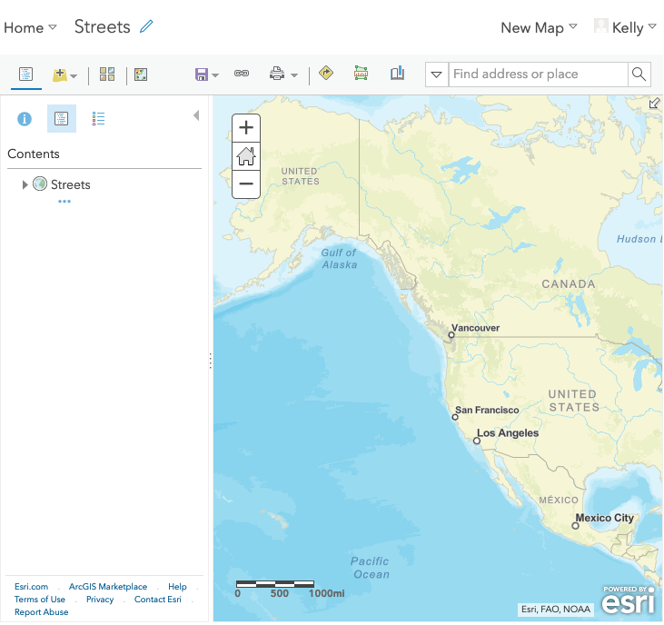

<!-- .slide: data-background="../reveal.js/img/bg-1.png" -->
<!-- .slide: class="title" -->
 
 
 
### Building Web Apps that Integrate with Your Portal
 
 Heather Gonzago and Kelly Hutchins

----

### Agenda

- Portal Overview
- Accessing Portal content
- Inside web map/scenes
- Working with portal layers
- Security
- Tools

----

### Advantages of working with AGO/Portal

 

- Sharing and managing secure resources
- Data hosting
- Easy to leverage
- Less code
- Reusable
- Organize/Update content centrally

----

### **Architecture: Apps + Content**

 

----

### **Content: Basic building block for Apps**
 

----

### SDK Resources

- <a href="https://developers.arcgis.com/javascript/latest/guide/working-with-platform/index.html" target="_blank">
Guide topic
</a>
 
- <a href="https://developers.arcgis.com/javascript/latest/sample-code/intro-widgets/index.html?search=Portal">Samples</a>

----

### Portal content: Unique identifier

Note: All portal content has a unique identifier
----

### Connect to Portal
 
- View of the portal
- authMode  <pre>anonymous|auto|immediate</pre>

<pre class="small" style="float:right;">
<code>
const portal = new Portal();
portal.authMode = "immediate";
portal.load().then(function(){});

</code></pre>

Note:Connect to the portal to get a view of the portal from the current users perspective. If anonymous you['ll get the default view of theportal. If logged in the info will be specific to the organization the user is a member of.

----

### Access Portal Properties

 

 - Details about the [portal](https://developers.arcgis.com/javascript/latest/api-reference/esri-portal-Portal.html)
 - Custom groups
 - Portal defaults like basemap, extent
 - [Helper services](https://jsapi.maps.arcgis.com/sharing/rest/portals/self?culture=en)

<pre class="med"><code>
   portal.load().then(function(){
     const orgName = portal.name;
     const basemapGallery = portal.basemapGalleryGroupQuery
     const defaultExtent = portal.defaultExtent;
  });
</code></pre>

Note: Get info about the portal including region, culture, name, thumbnail url and default properties like the basemap, extent and galleries

----

### Query portal content

- Portal.queryGroups(
- [Portal.queryItems()](https://developers.arcgis.com/javascript/latest/api-reference/esri-portal-Portal.html#queryItems)
- Portal.queryUsers()
- PortalGroup.queryItems()
- PortalUser.queryFavorites()

Note: Lots of methods available to easily query portal content. Get items, groups, users, favorites and more

----

### [PortalQueryParams](https://developers.arcgis.com/javascript/latest/api-reference/esri-portal-PortalQueryParams.html)
 

Note: Use portalQueryParams to refine the query. Code sample performs two queries and waits for results of both to
finish. queryItems takes in extent, owner name and list of layer types to return

----

### PortalQueryResult

[Results](https://developers.arcgis.com/javascript/latest/api-reference/esri-portal-PortalQueryResult.html) returned from a portal query

Note: Loop through the returned results array and create an item in a select box for each layer

----
### Add layer items

* Layer.fromPortalItem

----

### Web content - JSON

 

<a href="https://jsapi.maps.arcgis.com/sharing/rest/content/items/7761d81ff08e45f2a7f27997e8d3e92d?f=json">Map information</a>
 
<a href="https://jsapi.maps.arcgis.com/sharing/rest/content/items/7761d81ff08e45f2a7f27997e8d3e92d/data?f=json">Map details</a>

----

### **Demo: Inside the web map**

----
### Access a web map in an application
- esri/WebMap
- esri/WebScene
 

----

### Web map and scene : additional info

- [Bookmarks](https://developers.arcgis.com/javascript/latest/sample-code/widgets-bookmarks/index.html)
- [Slides](https://developers.arcgis.com/javascript/latest/sample-code/webscene-slide-tour/index.html)

Note: Web maps and scenes have additional info we can access like bookmarks and slides

----
### Widgets : Specify portal

- Basemap Gallery
 

 
- Search
 

----

### Demo: Portal Rest API via `esriRequest`

[ArcGIS REST API](https://developers.arcgis.com/rest/users-groups-and-items/working-with-users-groups-and-items.htm)

[DEMO](Demos/PortalAPISample.html)
----

### Access secure content

- Handles security so no need to write a bunch of code
- Detects private (unshared) data automatically
- If private, prompts for credentials
  - log-in via Identity Manager dialog prompt or
  - use the platform's provided OAuth framework to handle it for you

----
### **Benefits of using the platform security model**

- The web application does not have direct access to credentials
- Support for enterprise logins
- No need to sign in every time calls are made to a secure service
- Track app usage
- Easy to access resources secured with token-based authentication, e.g. premium credit-based services

----

### Demo: Access private data in a web application

----

### Demo: Register an application for Oauth use

----

### Access credit-based services

- Application handles it for you, no need to sign in
- Proxy file with saved credentials
  - Hosted proxy file provided by Esri OR
  - Host your own proxy file
  - Esri proxy -> https://github.com/Esri/resource-proxy
    - DotNet, JSP, and PHP

----

<!-- .slide: data-background="../reveal.js/img/bg-rating.jpg" -->

## Questions?

**Help us to improve** by filling out the survey

----
