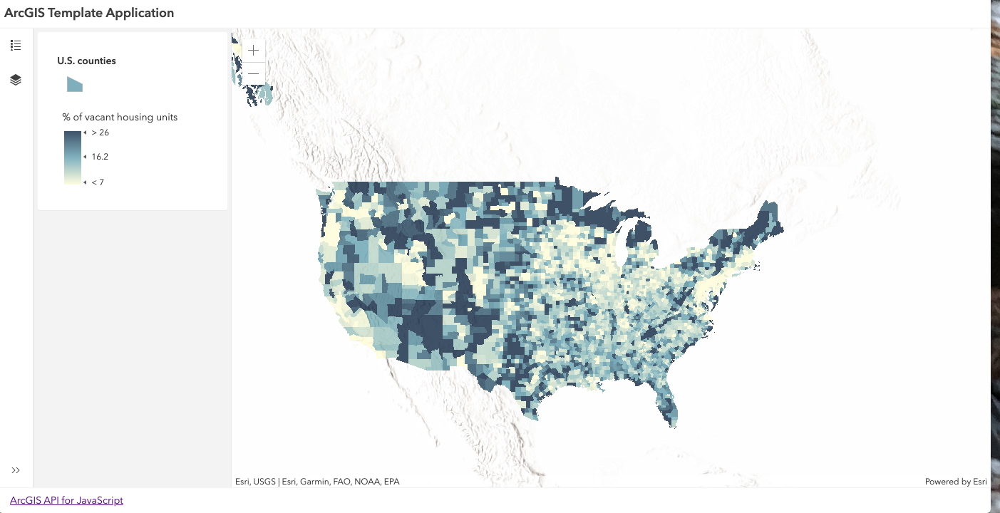
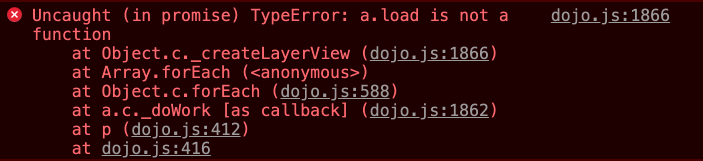
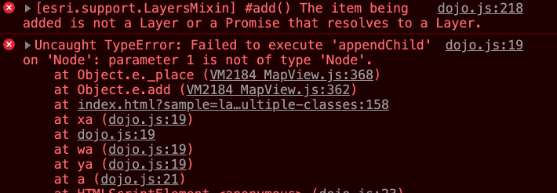
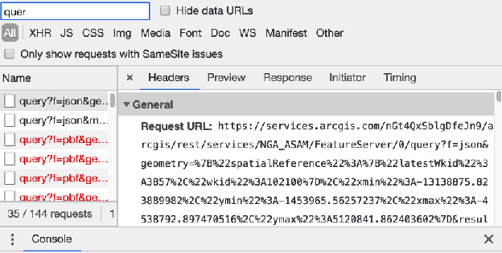
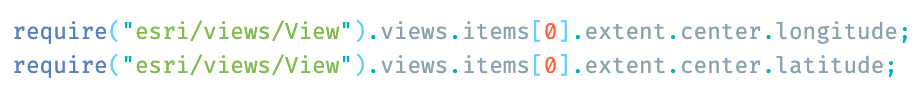
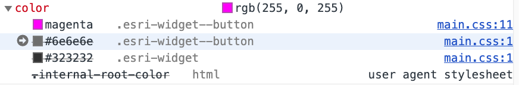

<!-- .slide: data-background="../reveal.js/img/bg-1.png" -->
<!-- .slide: class="title" -->
</br>
## Tips and Tricks for Developing and Debugging Apps
Kelly Hutchins and Heather Gonzago
</br>

#### 👉 <small>Slides & demos: http://bit.ly/2vDZXnj </small>👈

----


### Programming font
</br>
  - Ligatures
  - Fira Code, Hasklig, Cascadia  

  

----

### **Code snippets**
</br>

- Templates for reuseable code
- [ArcGIS API for JavaScript snippets](https://marketplace.visualstudio.com/items?itemName=Esri.arcgis-jsapi-snippets&ssr=false#overview)
- [Snippet generator](https://pawelgrzybek.com/snippet-generator/)

----

### ** Emmet**
- Emmet
 - Save keystrokes
 - HTML, CSS abbreviations
 - [Plug-in page](https://emmet.io/download/)


----

### **TypeScript/Babel**
</br>
<a href="./Demos/babel-demo/readme.md" target="_blank">
  
</a>
- Code assist
- ES6
- <a href="https://developers.arcgis.com/javascript/latest/guide/typescript-setup/" target="_blank">TypeScript setup</a>

----

### ** Starter App **
</br>

<a target="_blank" href="https://jsapi-414-template-app.surge.sh/">
</a>
- TypeScript
- WebPack
- [ArcGIS API JS Template App](https://github.com/odoe/jsapi-cli-template-app)

----

<!-- .slide: data-background="../reveal.js/img/bg-2.png" -->
### Modules out of order

Multiple errors can stem from wrong module order



----
<!-- .slide: data-background="../reveal.js/img/bg-2.png" -->
### Not getting the results you expect

- Has the view containing the map fully loaded before executing code?
- Has the <a href= "https://developers.arcgis.com/javascript/latest/sample-code/sandbox/index.html?sample=intro-layers" target="_blank">layer</a> fully loaded before performing specific functions?
- Wrap problem areas in <code>try/catch</code> statements for troubleshooting

<pre style="display:inline-block; padding: 5px; margin: 10px auto; width: 100%;"><code data-trim> 
// Create a MapView instance (for 2D viewing)
var view = new MapView({
  map: myMap,  // References a Map instance
  container: "viewDiv"  // References the ID of a DOM element
});

view.when(function(){
 // All the resources in the MapView and the map have loaded. Now execute additional processes
}, function(error){
 // Use the errback function to handle when the view doesn't load properly
 console.log("The view's resources failed to load: ", error);
});

</code></pre>

----
<!-- .slide: data-background="../reveal.js/img/bg-3.png" -->
### Demo: Debugging code using breakpoints


----

### ** Debugging: Network requests**

</br>


- Records all network requests
- Inspect network traffic, e.g. 
  - Search widget not displaying properly
  - GP task not executing as expected
  - Querying layer features
  
----
<!-- .slide: data-background="../reveal.js/img/bg-3.png" -->
</br>
</br>
### Demo: Network requests

----

<!-- .slide: data-background="../reveal.js/img/bg-2.png" -->
### Console: Run JavaScript 

 - Execute JavaScript
 - Check values of objects at an app breakpoint 
  
  <a target="_blank" href="https://developers.arcgis.com/javascript/latest/sample-code/webmap-basic/live/index.html"></a>

----


<!-- .slide: data-background="../reveal.js/img/bg-2.png" -->
### CSS: Color Themes 
</br>
- Detect user color scheme preferences 
  - CSS media feature (light, dark, no-preference)
- Emulate via dev tools
  
  <a href="./Demos/js-demo/index.html"> </a>
----
<!-- .slide: data-background="../reveal.js/img/bg-2.png" -->
#### CSS: Inspect Styles  
</br>
- Inspect element css 
- View classes applied to selected element

- <a target="_blank" href="https://developers.arcgis.com/javascript/latest/api-reference/esri-widgets-Search.html">View widget styles</a>

----

<!-- .slide: data-background="../reveal.js/img/bg-3.png" -->
## **ArcGIS API for JavaScript - next **

<a alt="Github repo for feedback-js-api-next" href="https://github.com/Esri/feedback-js-api-next">Esri/feedback-js-api-next</a>

NPM
```
 npm install --save arcgis-js-api@next
```
CDN 
```
<link rel="stylesheet" href="https://js.arcgis.com/next/esri/themes/light/main.css">
<script src="https://js.arcgis.com/next/"></script>

```

----

<!-- .slide: data-background="../reveal.js/img/bg-4.png" -->
</br>
## Questions?
</br>
- 👉Slides & demos: https://bit.ly/2vDZXnj 👈
- [ArcGIS API for JavaScript Snippets](https://marketplace.visualstudio.com/items?itemName=Esri.arcgis-jsapi-snippets)
- [ArcGIS API for JavaScript Guide topic - TypeScript setup](https://developers.arcgis.com/javascript/latest/guide/typescript-setup/)

----

<!-- .slide: data-background="../reveal.js/img/bg-rating.png" -->