<!-- .slide: data-background="../reveal.js/img/bg-1.png" -->
<!-- .slide: class="title" -->
  
### Getting Started with Web Development
### and the ArcGIS API for JavaScript
Heather Gonzago and Anne Fitz

<small>👉 Slides & demos: <code>https://bit.ly/3cnPptf</code> 👈</small>

----

### **Agenda**
 
 - Setup
 - First steps
 - Working with layers
 - Symbols and renderers
 - Make the map interactive
 - Filtering data
 - Widgets

----

### **Presentations accessible via GitHub**
   
  - This session focuses on version 4.x 
   
  - Concepts remain similar between versions 3.x and 4.x 
   
  - 👉 Slides & demos: <code>https://bit.ly/3cnPptf</code> 👈

----

### **Where do I begin?**
<a href="https://developers.arcgis.com/javascript/" target="_blank">
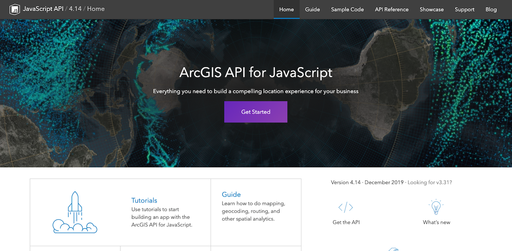
</a>

----

### **Which version of the API is best?**

----

### **Developer Setup**
 
<a href="https://www.slant.co/topics/1686/~javascript-ides-or-editors" target="_blank">
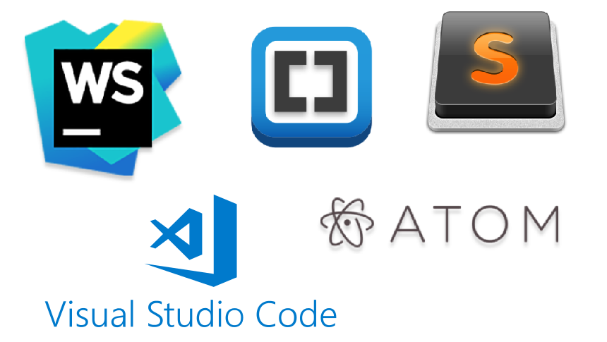
</a>

----

### **JSAPI Resources**
 

 - Includes
   - JSHint file
   - TypeScript definition file
   - Build tools (Webpack, npm)
   - <a href="https://developers.arcgis.com/javascript/latest/guide/using-frameworks/" target="_blank">Working with frameworks</a>

----

### **Get the API**
 
 - <a href="https://developers.arcgis.com/javascript/latest/guide/get-api/index.html#cdn" target="_blank">CDN</a>
 - <a href="https://developers.arcgis.com/javascript/latest/guide/get-api/index.html#using-npm-for-custom-builds" target="_blank">Custom builds</a>
 - <a href="https://developers.arcgis.com/downloads/" target="_blank">Download builds</a>
 
 
<iframe
  src="https://carbon.now.sh/embed?bg=rgba(194%2C186%2C206%2C1)&t=one-light&wt=sharp&l=htmlmixed&ds=true&dsyoff=3px&dsblur=13px&wc=true&wa=false&pv=30px&ph=36px&ln=false&fl=1&fm=Hack&fs=18px&lh=132%25&si=false&es=4x&wm=false&code=%253Clink%2520rel%253D%2522stylesheet%2522%2520href%253D%2522https%253A%252F%252Fjs.arcgis.com%252F4.15%252Fesri%252Fcss%252Fmain.css%2522%253E%2520%250A%253Cscript%2520src%253D%2522https%253A%252F%252Fjs.arcgis.com%252F4.15%252F%2522%253E%253C%252Fscript%253E"
  style="transform:scale(1); width:1024px; height:273px; border:0; overflow:hidden; display:block;"
  sandbox="allow-scripts allow-same-origin">
</iframe>
----

### CSS
 
- <a href="https://developers.arcgis.com/javascript/latest/guide/styling/index.html" target="_blank"><b>Main.css</b></a> contains styles for entire API
<iframe
  src="https://carbon.now.sh/embed?bg=rgba(194%2C186%2C206%2C1)&t=one-light&wt=sharp&l=auto&ds=true&dsyoff=3px&dsblur=13px&wc=true&wa=true&pv=30px&ph=38px&ln=false&fl=1&fm=Hack&fs=18px&lh=132%25&si=false&es=4x&wm=false&code=%253Clink%2520rel%253D%2522stylesheet%2522%2520href%253D%2522https%253A%252F%252Fjs.arcgis.com%252F4.15%252Fesri%252Fcss%252Fmain.css%2522%253E"
  style="transform:scale(1); width:924px; height:173px; border:0; overflow:hidden; display:block;"
  sandbox="allow-scripts allow-same-origin">
</iframe>
- <b>View.css</b> is smaller in size but better choice if only needing basic CSS (maps, widgets, etc.)
 
<iframe
  src="https://carbon.now.sh/embed?bg=rgba(194%2C186%2C206%2C1)&t=one-light&wt=sharp&l=auto&ds=true&dsyoff=3px&dsblur=13px&wc=true&wa=true&pv=30px&ph=38px&ln=false&fl=1&fm=Hack&fs=18px&lh=132%25&si=false&es=4x&wm=false&code=%253Clink%2520rel%253D%2522stylesheet%2522%2520href%253D%2522https%253A%252F%252Fjs.arcgis.com%252F4.15%252Fesri%252Fcss%252Fview.css%2522%253E"
  style="transform:scale(1); width:924px; height:173px; border:0; overflow:hidden; display:block;"
  sandbox="allow-scripts allow-same-origin">
</iframe>
- <a href="https://developers.arcgis.com/javascript/latest/guide/styling/#custom-css-using-sass" target="_blank">Custom CSS (SASS)</a>

----

### **First steps**
 
- How will your app be written?
- Separate files or one combined file?
 
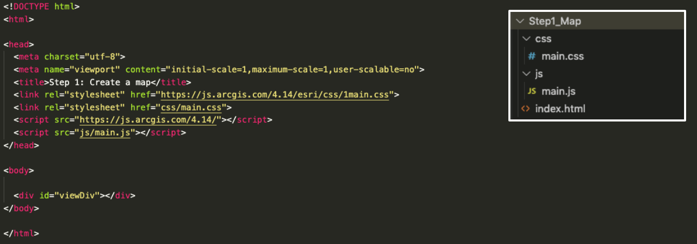

----

### **MapView**

Visualize data within Map or Scene
<iframe
  src="https://carbon.now.sh/embed?bg=rgba(194%2C186%2C206%2C1)&t=one-light&wt=sharp&l=auto&ds=true&dsyoff=3px&dsblur=13px&wc=true&wa=true&pv=24px&ph=34px&ln=false&fl=1&fm=Hack&fs=18px&lh=133%25&si=false&es=4x&wm=false&code=%2520%2520const%2520map%2520%253D%2520new%2520Map(%257B%250A%2520%2520%2520%2520basemap%253A%2520%2522gray-vector%2522%250A%2520%2520%257D)%253B"
  style="transform:scale(1); width:524px; height:230px; border:0; overflow:hidden; display:block; margin-left:150px;"
  sandbox="allow-scripts allow-same-origin">
</iframe>
<iframe
  src="https://carbon.now.sh/embed?bg=rgba(194%2C186%2C206%2C1)&t=one-light&wt=sharp&l=auto&ds=true&dsyoff=3px&dsblur=13px&wc=true&wa=true&pv=30px&ph=38px&ln=false&fl=1&fm=Hack&fs=18px&lh=132%25&si=false&es=4x&wm=false&code=const%2520view%2520%253D%2520new%2520MapView(%257B%250A%2520%2520container%253A%2520%2522viewDiv%2522%252C%250A%2520%2520map%253A%2520map%252C%250A%2520%2520zoom%253A%252012%252C%250A%2520%2520center%253A%2520%255B-117.168%252C%252032.776%255D%250A%257D)%253B"
  style="transform:scale(1); width:524px; height:286px; border:0; overflow:hidden; display:block; margin-left:150px;"
  sandbox="allow-scripts allow-same-origin">
</iframe>
<iframe
  src="https://carbon.now.sh/embed?bg=rgba(194%2C186%2C206%2C1)&t=one-light&wt=sharp&l=auto&ds=true&dsyoff=3px&dsblur=13px&wc=true&wa=true&pv=30px&ph=38px&ln=false&fl=1&fm=Hack&fs=18px&lh=132%25&si=false&es=4x&wm=false&code=const%2520view%2520%253D%2520new%2520SceneView(%257B%250A%2520%2520container%253A%2520%2522viewDiv%2522%252C%250A%2520%2520map%253A%2520map%252C%250A%2520%2520camera%253A%2520%257B%250A%2520%2520%2520%2520heading%253A%2520210%252C%250A%2520%2520%2520%2520tilt%253A%252078%252C%250A%2520%2520%2520%2520position%253A%2520%257B%250A%2520%2520%2520%2520%2520%2520x%253A%2520-8249335%252C%250A%2520%2520%2520%2520%2520%2520y%253A%25204832005%252C%250A%2520%2520%2520%2520%2520%2520z%253A%252050.7%252C%250A%2520%2520%2520%2520%2520%2520spatialReference%253A%2520%257B%250A%2520%2520%2520%2520%2520%2520%2520%2520wkid%253A%25203857%250A%2520%2520%2520%2520%2520%2520%257D%250A%2520%2520%2520%2520%257D%250A%2520%2520%257D%250A%257D)%253B"
  style="transform:scale(1); width:524px; height:573px; border:0; overflow:hidden; float: right; margin-top:-515px; margin-right:150px;"
  sandbox="allow-scripts allow-same-origin">
</iframe>

----

### **Demo: Make a map**
 
<a href="Demos/Step1_Map/" target="_blank">
  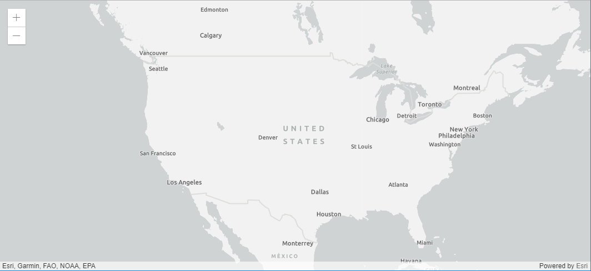
</a>

----

### **Common Gotchas**

- Module order makes a difference
- Missing module 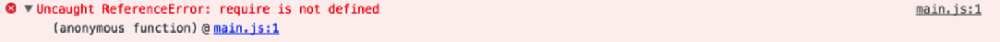
- Missing CSS 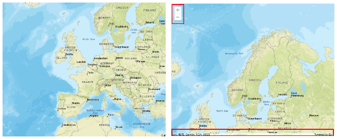

----

### **Add layers**
 

 - <a href="https://developers.arcgis.com/javascript/latest/api-reference/index.html#modules-in-esri-layers" target="_blank">Various layer types</a>
1. Load module  
2. Create layers  
3. Set properties  
4. Add to map or scene 
 
 - Basic steps remain the same

----

### **Properties**
- No need for a bunch of get/set statements
<iframe
  src="https://carbon.now.sh/embed?bg=rgba(194%2C186%2C206%2C1)&t=one-light&wt=sharp&l=auto&ds=true&dsyoff=3px&dsblur=13px&wc=true&wa=true&pv=30px&ph=38px&ln=false&fl=1&fm=Hack&fs=18px&lh=132%25&si=false&es=4x&wm=false&code=const%2520map%2520%253D%2520new%2520Map()%253B%250Amap.basemap%2520%253D%2520%2522streets%2522%253B%250Aconst%2520view%2520%253D%2520new%2520MapView()%253B%250Aview.center%2520%253D%2520%255B-100%252C%252040%255D%253B%250Aview.zoom%2520%253D%25206%253B"
  style="transform:scale(1); width:1024px; height:273px; border:0; overflow:hidden; display:block;"
  sandbox="allow-scripts allow-same-origin">
</iframe>
- <a href="https://developers.arcgis.com/javascript/latest/guide/programming-patterns/#properties" target="_blank">Properties</a> can be set in constructor
<iframe
  src="https://carbon.now.sh/embed?bg=rgba(194%2C186%2C206%2C1)&t=one-light&wt=sharp&l=auto&ds=true&dsyoff=3px&dsblur=13px&wc=true&wa=true&pv=30px&ph=38px&ln=false&fl=1&fm=Hack&fs=18px&lh=132%25&si=false&es=4x&wm=false&code=const%2520map%2520%253D%2520new%2520Map(%257B%250A%2520%2520basemap%253A%2520%2522streets%2522%250A%257D)%253B%250Aconst%2520view%2520%253D%2520new%2520MapView(%257B%250A%2520%2520map%253A%2520map%252C%2520%250A%2520%2520center%253A%2520%255B-100%252C%252040%255D%252C%250A%2520%2520zoom%253A%25206%250A%257D)%253B"
  style="transform:scale(1); width:1024px; height:315px; border:0; overflow:hidden; display:block;"
  sandbox="allow-scripts allow-same-origin">
</iframe>

----

### **Watch for property changes**
 
- <a href="https://developers.arcgis.com/javascript/latest/api-reference/esri-core-Accessor.html#watch" target="_blank">Watch</a> for changes  
<iframe
  src="https://carbon.now.sh/embed?bg=rgba(194%2C186%2C206%2C1)&t=one-light&wt=sharp&l=auto&ds=true&dsyoff=3px&dsblur=13px&wc=true&wa=true&pv=30px&ph=38px&ln=false&fl=1&fm=Hack&fs=18px&lh=132%25&si=false&es=4x&wm=false&code=layer.watch(%2522loadStatus%2522%252C%2520function(status)%2520%257B%252F%252F%2520do%2520something%257D)%253B"
  style="transform:scale(1); width:1024px; height:173px; border:0; overflow:hidden; display:block;"
  sandbox="allow-scripts allow-same-origin">
</iframe>
- Can also use <a href="https://developers.arcgis.com/javascript/beta/api-reference/esri-core-watchUtils.html" target="_blank">esri/core/watchUtils</a> utility methods 
 
- See this in action with the <a href="https://developers.arcgis.com/javascript/latest/sample-code/watch-for-changes/index.html" target="_blank">Watch for Changes</a> sample

----

### **Demo: Add layer to sample app**
 
<a href="Demos/Step2_Layer/" target="_blank">
  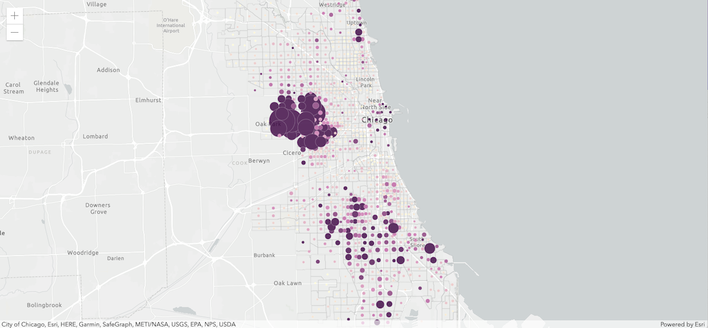
</a>

----

### **Renderers**
 
- <a href="https://developers.arcgis.com/javascript/latest/sample-code/get-started-visualization/index.html" target="_blank">Define</a> a set of symbols to use for the layer 
 
- Sets the rules on how the symbols are used 
 
- Basic coding pattern
<iframe
  src="https://carbon.now.sh/embed?bg=rgba(194%2C186%2C206%2C1)&t=one-light&wt=sharp&l=auto&ds=true&dsyoff=3px&dsblur=13px&wc=true&wa=true&pv=30px&ph=38px&ln=false&fl=1&fm=Hack&fs=18px&lh=132%25&si=false&es=4x&wm=false&code=const%2520layerRenderer%2520%253D%2520new%2520UniqueValueRenderer()%253B%2520%252F%252F%2520Set%2520the%2520renderer%250Aconst%2520featurelayer%2520%253D%2520new%2520FeatureLayer(%257B%250A%2520%2520url%253A%2520%2522featurelayer%2520url%2522%252C%250A%2520%2520renderer%253A%2520layerRenderer%2520%252F%252F%2520pass%2520in%2520renderer%2520to%2520featurelayer%2520using%2520default%2520properties%250A%257D)"
  style="transform:scale(1); width:924px; height:273px; border:0; overflow:hidden; display:block;"
  sandbox="allow-scripts allow-same-origin">
</iframe>

----

### **Symbols**
- Renderers use symbology, e.g. points, lines, polygons 
- Can set symbology via a renderer's <a href="https://developers.arcgis.com/javascript/latest/api-reference/esri-renderers-visualVariables-VisualVariable.html" _blank>visual variables</a>
 
 
<iframe
  src="https://carbon.now.sh/embed?bg=rgba(171%2C%20184%2C%20195%2C%201)&t=one-light&wt=sharp&l=javascript&ds=true&dsyoff=20px&dsblur=68px&wc=false&wa=false&pv=14px&ph=13px&ln=false&fl=1&fm=Hack&fs=16.5px&lh=133%25&si=false&es=4x&wm=false&code=const%2520sizeVisualVariable%2520%253D%2520%257B%250A%2520%2520type%253A%2520'size'%252C%250A%2520%2520field%253A%2520'WIND_SPEED'%252C%250A%2520%2520minDataValue%253A%25200%252C%250A%2520%2520maxDataValue%253A%252060%252C%250A%2520%2520minSize%253A%25208%252C%250A%2520%2520maxSize%253A%252040%250A%257D%250A%252F%252F%2520Apply%2520visual%2520variable%2520to%2520renderer%250Arenderer.visualVariables%2520%253D%2520%255BsizeVisualVariable%255D%250A%252F%252F%2520Create%2520the%2520layer%250Aconst%2520featureLayer%2520%253D%2520new%2520FeatureLayer(%257B%250A%2520%2520url%253A%2520'%253CURL%2520to%2520feature%2520layer'%252C%250A%2520%2520outFields%253A%2520%255B'*'%255D%252C%250A%2520%2520renderer%253A%2520renderer%2520%252F%252F%2520Add%2520the%2520renderer%2520to%2520the%2520feature%2520layer%250A%257D)"
  style="transform:scale(1); width:1024px; height:473px; border:0; overflow:hidden;"
  sandbox="allow-scripts allow-same-origin">
</iframe>

----

### **Autocasting**
 
- No need to <b>Require()</b> the module 
 
- Look for the  label in the API Reference 
 
- <a href="https://developers.arcgis.com/javascript/latest/sample-code/sandbox/index.html?sample=layers-portal" target="_blank">Create a layer from portal item sample </a> shows autocasting in action 
 
- Read more about <a href="https://developers.arcgis.com/javascript/latest/guide/programming-patterns/#autocasting" target="_blank">Autocasting</a> in the Guide 

----

### **Demo: Update a feature layer's renderer**
 
<a href="Demos/Step3_LayerRenderer/" target="_blank">
  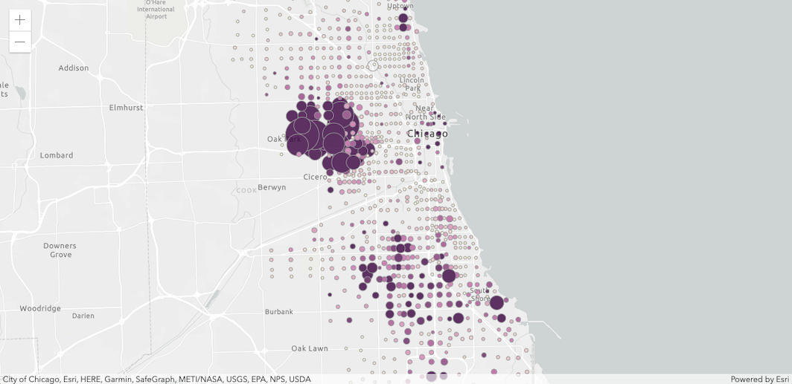
</a>

----

### **Map interaction using popups**
 
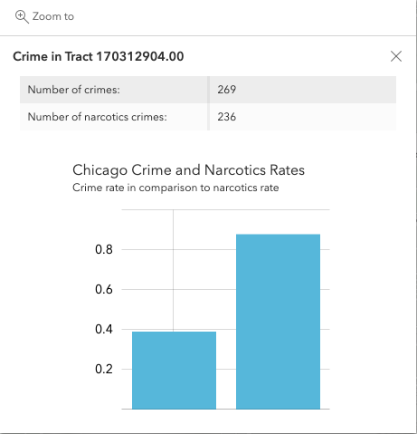

- Responds to mouse clicks
  
- Provides info on:
  - feature attributes
  - location
  - search results
  
- Customizable

----

### **PopupTemplate**
- View has a default instance of <a href="https://developers.arcgis.com/javascript/latest/api-reference/esri-views-View.html#popup" target="_blank">popup</a>
- FeatureLayer has associated <a href="https://developers.arcgis.com/javascript/latest/api-reference/esri-PopupTemplate.html" target="_blank">popupTemplate</a> property
- Position the popup using <a href="https://developers.arcgis.com/javascript/latest/api-reference/esri-widgets-Popup.html#dockOptions" target="_blank"><code>dockOptions</code></a>
<iframe
  src="https://carbon.now.sh/embed?bg=rgba(194%2C186%2C206%2C1)&t=one-light&wt=sharp&l=auto&ds=true&dsyoff=3px&dsblur=13px&wc=true&wa=true&pv=30px&ph=36px&ln=false&fl=1&fm=Hack&fs=18px&lh=132%25&si=false&es=4x&wm=false&code=const%2520popupTemplate%2520%253D%2520new%2520PopupTemplate(%257B%250A%2520%2520title%253A%2520%2522Title%2520of%2520the%2520popup%2522%252C%250A%2520%2520content%253A%2520%255B%257B%250A%2520%2520%2520%2520%252F%252F%2520Set%2520the%2520content%2520here%250A%2520%2520%257D%255D%250A%257D)%253B"
  style="transform:scale(1); width:1024px; height:273px; border:0; overflow:hidden; display:block;"
  sandbox="allow-scripts allow-same-origin">
</iframe>
<iframe
  src="https://carbon.now.sh/embed?bg=rgba(194%2C186%2C206%2C1)&t=one-light&wt=sharp&l=auto&ds=true&dsyoff=3px&dsblur=13px&wc=true&wa=true&pv=30px&ph=36px&ln=false&fl=1&fm=Hack&fs=18px&lh=132%25&si=false&es=4x&wm=false&code=const%2520featurelayer%2520%253D%2520new%2520FeatureLayer(%257B%250A%2520%2520url%253A%2520%2522url%2520to%2520the%2520feature%2520layer%2522%252C%250A%2520%2520outFields%253A%2520%255B%2522*%2522%255D%252C%250A%2520%2520popupTemplate%253A%2520popupTemplate%252C%250A%2520%2520renderer%253A%2520renderer%250A%257D)%253B"
  style="transform:scale(1); width:1024px; height:273px; border:0; overflow:hidden; display:block;"
  sandbox="allow-scripts allow-same-origin">
</iframe>

----

### **Demo: Add a popup to the map**
 
<a href="Demos/Step4_Popup/" target="_blank">
  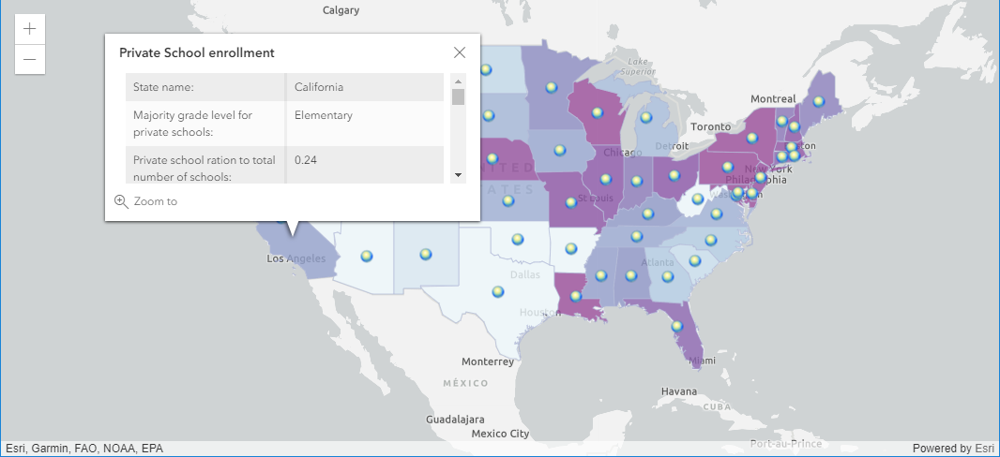
</a>

----

### **Filtering data**

- <a href="https://developers.arcgis.com/javascript/latest/api-reference/esri-views-layers-support-FeatureFilter.html" target="_blank"><code>FeatureFilter</code></a>
- <a href="https://developers.arcgis.com/javascript/latest/api-reference/esri-views-layers-FeatureLayerView.html" target="_blank"><code>FeatureLayerView</code></a>
- All data is filtered on the client = better performance

<iframe
  src="https://carbon.now.sh/embed?bg=rgba(171%2C%20184%2C%20195%2C%201)&t=one-light&wt=sharp&l=javascript&ds=true&dsyoff=20px&dsblur=68px&wc=true&wa=true&pv=14px&ph=13px&ln=false&fl=1&fm=Hack&fs=17px&lh=133%25&si=false&es=4x&wm=false&code=switch%2520(selectedCrimeAmount)%2520%257B%250A%2520%2520case%2520'100'%253A%250A%2520%2520%2520%2520crimeLayerView.filter%2520%253D%2520%257B%250A%2520%2520%2520%2520%2520%2520where%253A%2520%2522CrimeCnt%2520%253E%253D%2520'%2522%2520%252B%2520selectedCrimeAmount%2520%252B%2520%2522'%2522%250A%2520%2520%2520%2520%257D%250A%2520%2520%2520%2520break%250A%2520%2520case%2520'50-99'%253A%250A%2520%2520%2520%2520crimeLayerView.filter%2520%253D%2520%257B%250A%2520%2520%2520%2520%2520%2520where%253A%2520'(CrimeCnt%2520%253E%253D%252050)'%2520%252B%2520'AND'%2520%252B%2520'(CrimeCnt%2520%253C%253D%252099)'%250A%2520%2520%2520%2520%257D%250A%2520%2520%2520%2520break%250A%2520%2520case%2520'49'%253A%250A%2520%2520%2520%2520crimeLayerView.filter%2520%253D%2520%257B%250A%2520%2520%2520%2520%2520%2520where%253A%2520%2522CrimeCnt%2520%253C%253D%2520'%2522%2520%252B%2520selectedCrimeAmount%2520%252B%2520%2522'%2522%250A%2520%2520%2520%2520%257D%250A%257D"
  style="transform:scale(1); width:1024px; height:473px; border:0; overflow:hidden;"
  sandbox="allow-scripts allow-same-origin">
</iframe>

----

### **Demo: Filter features within a layer**

<a href="Demos/Step5_LayerFilter/" target="_blank">
  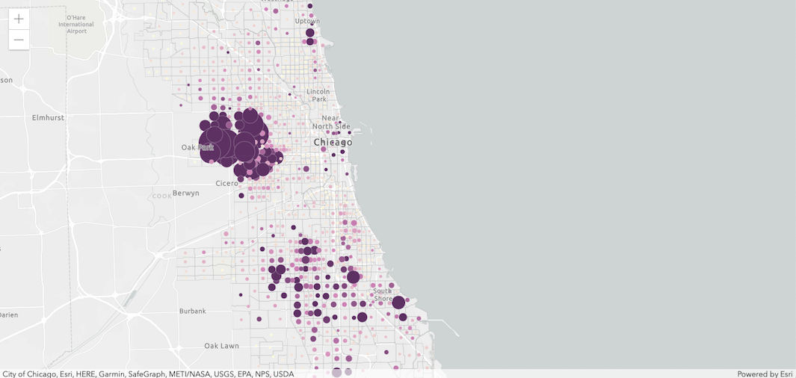
</a>

----

### **Using web maps**
 
- Reduces coding effort 
- Retains all customizations with rendering, popups, etc.
 
 
<iframe
  src="https://carbon.now.sh/embed?bg=rgba(194%2C186%2C206%2C1)&t=one-light&wt=sharp&l=auto&ds=true&dsyoff=3px&dsblur=13px&wc=true&wa=true&pv=30px&ph=36px&ln=false&fl=1&fm=Hack&fs=18px&lh=132%25&si=false&es=4x&wm=false&code=const%2520map%2520%253D%2520new%2520WebMap(%257B%250A%2520%2520portalItem%253A%2520%257B%250A%2520%2520%2520%2520id%253A%2520%2522f9a9a7e3857d4d51b2c801cf8c399add%2522%2520%252F%252F%2520Remember%2520portalItem%2520is%2520autocasted%250A%2520%2520%257D%250A%257D)%253B"
  style="transform:scale(1); width:1024px; height:473px; border:0; overflow:hidden; display:block;"
  sandbox="allow-scripts allow-same-origin">
</iframe>

----

### **Demo: Add a web map to an application**
 
<a href="Demos/Step6_Webmap/" target="_blank">
  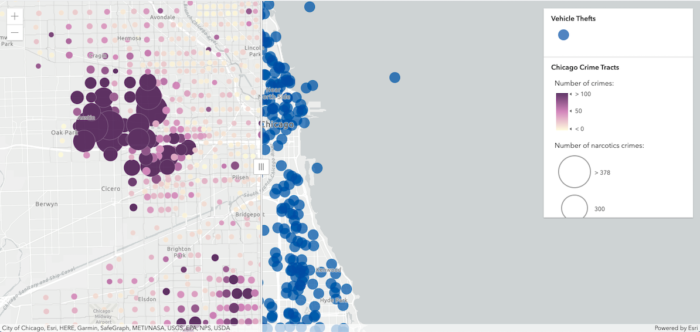
</a>

----

### **Widgets**

- <a href="https://developers.arcgis.com/javascript/latest/api-reference/index.html#modules-in-esri-widgets" target="_blank">Encapsulates functionality</a>
- Similar coding pattern across all widgets
 
 
<iframe
  src="https://carbon.now.sh/embed?bg=rgba(194%2C186%2C206%2C1)&t=one-light&wt=sharp&l=auto&ds=true&dsyoff=3px&dsblur=13px&wc=true&wa=true&pv=30px&ph=36px&ln=false&fl=1&fm=Hack&fs=18px&lh=132%25&si=false&es=4x&wm=false&code=view.when(function)%257B%250A%2520%2520const%2520featurelayer%2520%253D%2520map.layers.getItemAt(1)%253B%250A%2520%2520%252F%252F%25201.%2520Create%2520the%2520widget%250A%2520%2520const%2520legend%2520%253D%2520new%2520Legend(%257B%250A%2520%2520%2520%2520%252F%252F%25202.%2520Specify%2520properties%2520for%2520widget%250A%2520%2520%2520%2520view%253A%2520view%252C%250A%2520%2520%2520%2520layerInfos%253A%2520%255B%257B%250A%2520%2520%2520%2520%2520%2520%2520%2520layer%253A%2520featurelayer%252C%250A%2520%2520%2520%2520%2520%2520%2520%2520title%253A%2520%2522Name%2522%250A%2520%2520%2520%2520%257D%255D%250A%257D)%253B%250A%2520%2520%252F%252F%25203.%2520Add%2520widget%2520to%2520the%2520view%2520UI%250A%2520%2520view.ui.add(legend%252C%2520%2522top-right%2522)%253B%250A%257D)%253B"
  style="transform:scale(1); width:675px; height:473px; border:0; overflow:hidden; display:block;"
  sandbox="allow-scripts allow-same-origin">
</iframe>

----

### ** View UI**

- Position widgets
  - Add
  - Move
  - Remove
 
 
<iframe
  src="https://carbon.now.sh/embed?bg=rgba(194%2C186%2C206%2C1)&t=one-light&wt=sharp&l=auto&ds=true&dsyoff=3px&dsblur=13px&wc=true&wa=true&pv=30px&ph=36px&ln=false&fl=1&fm=Hack&fs=18px&lh=132%25&si=false&es=4x&wm=false&code=view.ui.add(legend%252C%2520%2522bottom-left%2522)%253B%250Aview.ui.add(swipe)%253B"
  style="transform:scale(1); width:624px; height:273px; border:0; overflow:hidden; display:block;"
  sandbox="allow-scripts allow-same-origin">
</iframe>

----

### **Demo: Add widgets to the application**
 
<a href="Demos/Step7_Widgets/" target="_blank">
  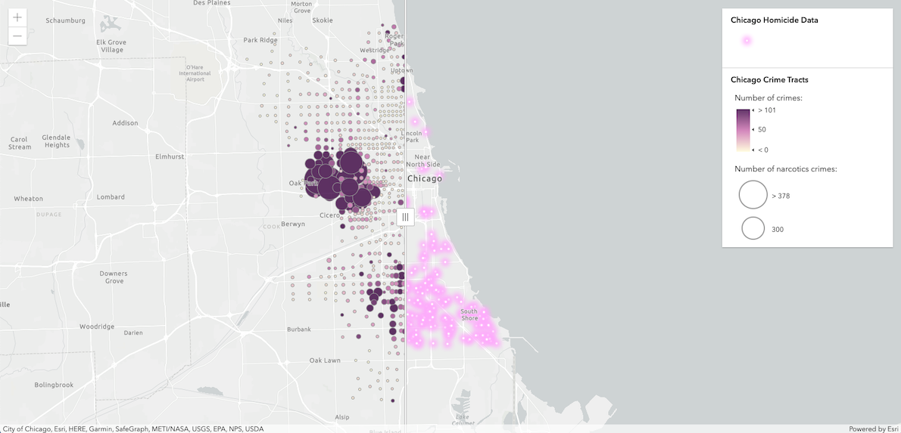
</a>

----

### **Where can I get more info?**

- SDK Documentation
- Esri-related training and webinars
- JavaScript online training, free and not-so-free
- User forums, e.g. <a href="https://community.esri.com/community/developers/web-developers/arcgis-api-for-javascript/" target="_blank">GeoNet</a>, <a href="https://gis.stackexchange.com/questions/tagged/arcgis-javascript-api-4" target="_blank">StackExchange</a>, <a href="https://thespatialcommunity.org/" target="_blank">Spatial Community in Slack</a>, etc.
<a href="https://developers.arcgis.com/javascript/support/index.html" target="_blank">
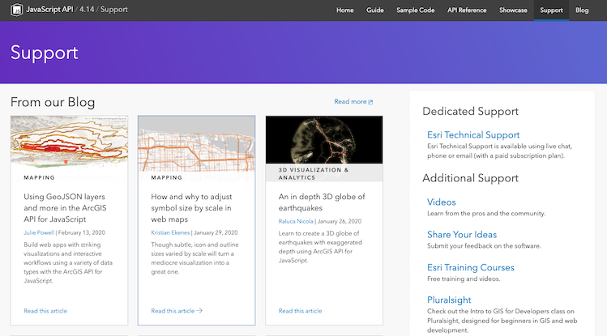</a>

----