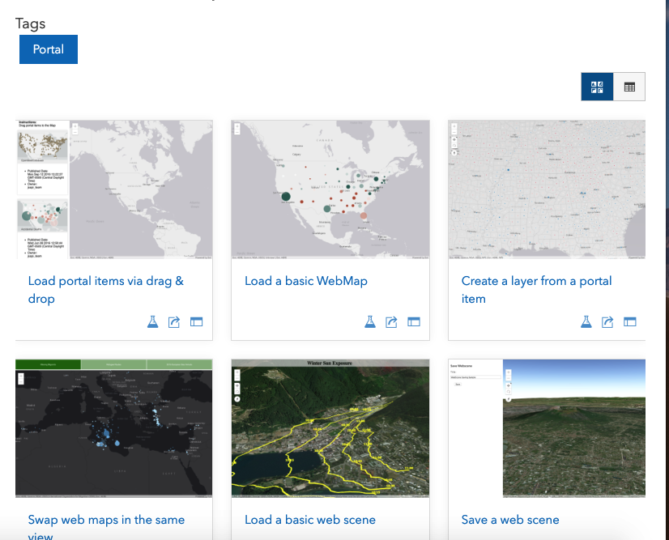
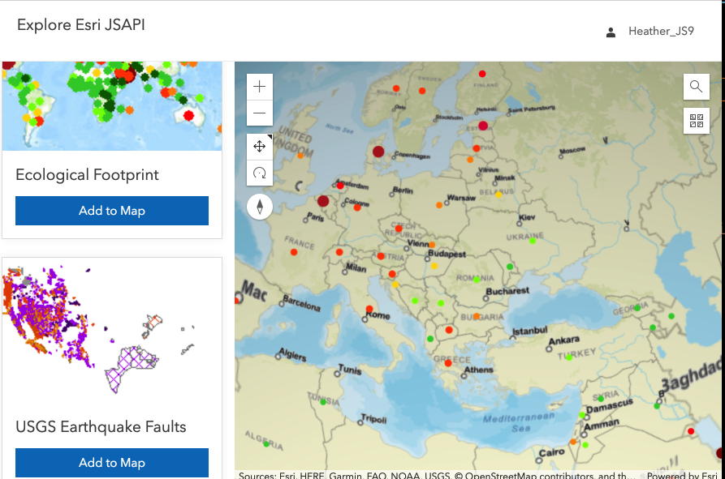

<!-- .slide: data-background="../reveal.js/img/bg-1.png" -->
<!-- .slide: class="title" -->
 
 
 
### Building Web Apps that Integrate with Your Portal
 
Heather Gonzago and Kelly Hutchins

----

### Agenda

* General AGO/Portal overview
* Inside web map/scenes
* Adding ArcGIS Online content to a JavaScript application
* Working with secured ArcGIS Online items in a JavaScript application

----

### Advantages of working with AGO/Portal

 

- Sharing and managing secure resources
- Data hosting
- Easy to leverage
- Less code
- Reusable
- Organize/Update content centrally 

----

### Architecture: Apps + Content

 

----

### Content: Basic building block for Apps
 

----
### Advantages of working with AGO/Portal

 

- Sharing and managing secure resources
- Data hosting
- Easy to leverage
- Less code
- Reusable
- Organize/Update content centrally

----
### Architecture: Apps + Content

 

----
### SDK Resources

- <a href="https://developers.arcgis.com/javascript/latest/guide/working-with-platform/index.html" target="_blank">
Guide topic
</a>
 
- <a href="https://developers.arcgis.com/javascript/latest/sample-code/intro-widgets/index.html?search=Portal">Samples</a>
- <a href="https://developers.arcgis.com/documentation/core-concepts/security-and-authentication">Developers site</a>

----
### Build a portal app from scratch

----
### Step 1: Setup Authentication
* <a href="https://developers.arcgis.com/javascript/latest/api-reference/esri-identity-IdentityManager.html#registerOAuthInfos" target="_blank">Register the app</a>
<pre style="display:inline-block; padding: 5px; margin: 10px auto; width: 100%;"><code data-trim> 
// Create OAuthInfo
  var oauthInfo = new OAuthInfo({
    appId: "enterAppIdHere" // registered app id on AGO
  });
esriId.registerOAuthInfos([oauthInfo]); 
</code></pre>
 
* <a href="https://developers.arcgis.com/javascript/latest/api-reference/esri-identity-IdentityManager.html#getCredential" target="_blank">Sign in and get credential</a>
 
<pre style="display:inline-block; padding: 5px; margin: 10px auto; width: 100%;"><code data-trim> 
  credential = await IdentityManager.getCredential(portalUrl);
</code></pre>
 
* <a href="https://developers.arcgis.com/javascript/latest/api-reference/esri-identity-IdentityManager.html#getCredential" target="_blank">Sign out and destroy credentials</a>
 
<pre style="display:inline-block; padding: 5px; margin: 10px auto; width: 100%;"><code data-trim> 
IdentityManager.destroyCredentials();
</code></pre>

----

### Register an app
- <a href="https://www.arcgis.com" target="_blank">ArcGIS Online</a>
- <a href="https://developers.arcgis.com/applications" target="_blank">ArcGIS for Developers site</a>
 

----
### OAuth2: Identity Manager
- Authentication functionality provided via the Identity Manager
- Handles the complexity of calling endpoints and parsing tokens
- Example: JS API Identity Manager
  - `OAuthInfo` class -> pass in registered `App ID`
  - Pass this information to the Identity Manager

----
### Demo: Add Authentication to app
 

----
### Step 2: Display a map
* <a href="https://developers.arcgis.com/javascript/latest/api-reference/esri-WebMap.html" target="_blank">2D:esri/WebMap</a>
* <a href="https://developers.arcgis.com/javascript/latest/api-reference/esri-WebScene.html" target="_blank">3D:esri/WebScene</a>
<pre style="display:inline-block; padding: 5px; margin: 10px auto; width: 100%;"><code data-trim>
// Step 2 create simple 3d (or 2d map)
const map = new WebMap({
  portalItem: {
    id: "7761d81ff08e45f2a7f27997e8d3e92d"
  }
});
const view = new SceneView({
  map,
  zoom: 4,
  center: [-98, 35],
  container: "viewDiv"
});
</pre></code>

----
###  Unique identifiers

Note: All portal content has a unique identifier

----
### Bookmarks and Slides

* <a href="https://developers.arcgis.com/javascript/latest/api-reference/esri-widgets-Bookmarks.html" target="_blank">Bookmarks widget</a>
* <a href="https://developers.arcgis.com/javascript/latest/sample-code/webscene-slide-tour/index.html" target="_blank">WebScene slides</a>

----
### Demo: Display the map
 

----
### Step 3: Connect to Portal

* <a href="https://developers.arcgis.com/javascript/latest/api-reference/esri-portal-Portal.html" target="_blank">View of the Portal</a>
* <a href="https://developers.arcgis.com/javascript/latest/api-reference/esri-portal-Portal.html#load" target="_blank">Load the Portal's resources</a>

<pre class="small" style="display:inline-block; padding: 5px; margin: 10px auto; float:right;"><code data-trim>
// Step 3 Connect to portal
async function loadPortal() {
  const portal = new Portal();
  await portal.load();
}
</code></pre>

Note:Connect to the portal to get a view of the portal from the current users perspective. If anonymous you will get the default view of the portal. If logged in, the info will be specific to the organization the user is a member of.

----
### Access portal properties

 - Details about the [portal](https://developers.arcgis.com/javascript/latest/api-reference/esri-portal-Portal.html)
 - <a href="https://developers.arcgis.com/rest/users-groups-and-items/portal-self.htm" target="_blank">Portal <code>Self</code> call</a>
 - Custom groups
 - Portal defaults like basemap, extent
 - [Helper services](https://jsapi.maps.arcgis.com/sharing/rest/portals/self?culture=en)

<pre class="med" style="padding: 5px; margin: 10px auto;"><code data-trim>
   portal.load().then(function(){
     const orgName = portal.name;
     const basemapGallery = portal.basemapGalleryGroupQuery
     const defaultExtent = portal.defaultExtent;
  });
</code></pre>

Note: Get info about the portal including region, culture, name, thumbnail url and default properties like the basemap, extent and galleries

----
### Demo: Connect to Portal
 

----
### Step 4a: Query portal content

* <a href="https://developers.arcgis.com/javascript/latest/api-reference/esri-portal-Portal.html#queryGroups" target="_blank">Portal.queryGroups()</a>
* <a href="https://developers.arcgis.com/javascript/latest/api-reference/esri-portal-Portal.html#queryItems" target="_blank">Portal.queryItems()</a>
* <a href="https://developers.arcgis.com/javascript/latest/api-reference/esri-portal-Portal.html#queryUsers" target="_blank">Portal.queryUsers()</a>
* <a href="https://developers.arcgis.com/javascript/latest/api-reference/esri-portal-PortalGroup.html#queryItems" target="_blank">PortalGroup.queryItems()</a>
* <a href="https://developers.arcgis.com/javascript/latest/api-reference/esri-portal-PortalUser.html#queryFavorites" target="_blank">PortalUser.queryFavorites()</a>

----
### [PortalQueryParams](https://developers.arcgis.com/javascript/latest/api-reference/esri-portal-PortalQueryParams.html)
 
<pre style="display:inline-block; padding: 5px; margin: 10px auto; width: 100%;"><code data-trim> 
// Get a few items from the default portal or get a few
// items from logged in user and display as thumbnails in side panelconst 

const layerTypes = '(type:("Feature Collection" OR "Feature Service" OR "Map Service" )
-typekeywords:"Table")  -type:"Code Attachment" -type:"Featured Items" -type:"Symbol Set"
-type:"Color Set" -type:"Windows Viewer Add In" -type:"Windows Viewer Configuration"
-type:"Map Area" -typekeywords:"MapAreaPackage"';

const query = user ? `owner:${user} ${layerTypes}` : layerTypes;
</code></pre>

----
### Step 4b: Display query results
PortalQueryResult
[Results](https://developers.arcgis.com/javascript/latest/api-reference/esri-portal-PortalQueryResult.html) returned from a portal query

<pre style="display:inline-block; padding: 5px; margin: 10px auto; width: 100%;"><code data-trim> 
const itemResults = await portal.queryItems({
  extent: view.extent,
  query
});
</code></pre>

----
### **Demo: Get and display content from Portal**
 

----
### Step 5a: Setup add layer click handler

<pre style="display:inline-block; padding: 5px; margin: 10px auto; width: 100%;"><code data-trim> 
Array.from(document.getElementsByClassName("add-btn")).forEach(function (element) {
  element.addEventListener("click", () => addLayerToMap({
    id: element.getAttribute("data-item")
  }));
});
</code></pre>

----
### Step 5b: Add layer to map

* <a href="https://developers.arcgis.com/javascript/latest/api-reference/esri-layers-Layer.html#fromPortalItem" target="_blank">Layer.fromPortalItem</a>
* <a href="https://developers.arcgis.com/javascript/latest/api-reference/esri-views-SceneView.html#goTo" target="_blank">Zoom to layer when ready</a>

<pre style="display:inline-block; padding: 5px; margin: 10px auto; width: 100%;"><code data-trim> 
const layer = await Layer.fromPortalItem(item);
layer.watch("loadStatus", (status) => {
  if (status === "loaded") {
    view.goTo(layer.fullExtent);
  }
});
view.map.add(layer);
}
</code></pre>

----
### **Demo: Add layer to map**
 

----
### Step 6: Add widgets

<a href="https://developers.arcgis.com/javascript/latest/api-reference/esri-widgets-BasemapGallery.html" target="_blank">Basemap Gallery</a>

<pre style="display:inline-block; padding: 5px; margin: 10px auto; width: 100%;"><code data-trim> 
const basemapGallery = new BasemapGallery({
  view,
  source: portal
});
</code></pre>
<a href="https://developers.arcgis.com/javascript/latest/api-reference/esri-widgets-Search.html" target="_blank">Search</a>

<pre style="display:inline-block; padding: 5px; margin: 10px auto; width: 100%;"><code data-trim> 
const search = new Search({
  view,
  portal
});
</code></pre>

Note: Pass in portal to some widgets to get portal defaults. In this example we'll get search locators and the basemap group

----
### **Demo: Add widgets**
 

----
### MISC: Portal API via esriRequest

[Portal REST API](https://developers.arcgis.com/rest/users-groups-and-items/portal.htm)

[DEMO](demos/Demos-BU/PortalAPISample.html)

----
### MISC: Access credit-based services

- Application handles it for you, no need to sign in
- Proxy file with saved credentials
  - Hosted proxy file provided by Esri OR
  - Host your own proxy file
  - Esri proxy -> https://github.com/Esri/resource-proxy
    - DotNet, JSP, and PHP
  
----

### **Tools: AGO Assistant**

----

<!-- .slide: data-background="../reveal.js/img/bg-rating.png" -->

----
