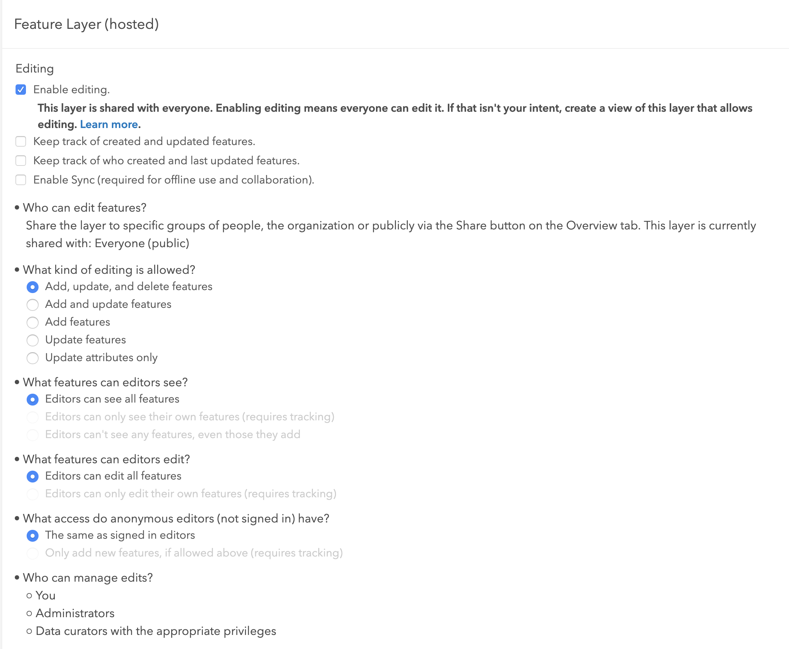
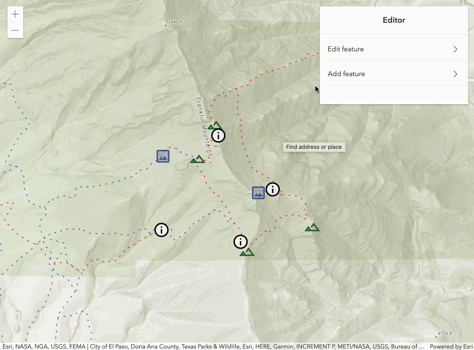
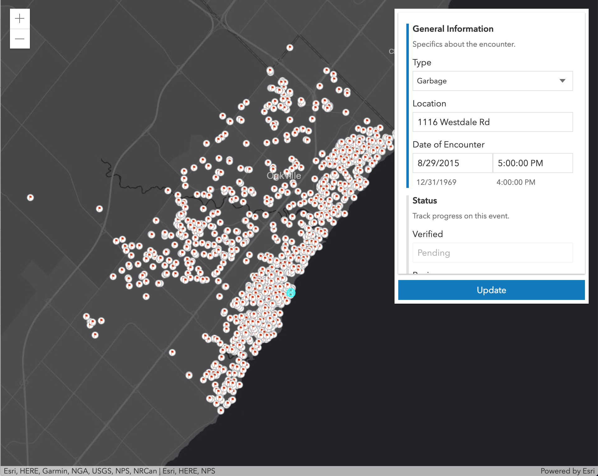

<!-- .slide: data-background="../reveal.js/img/bg-1.png" -->
<!-- .slide: class="title" -->
 
 
### ArcGIS API for JavaScript: 
### Web Editing in 2D and 3D

#### Jonathan Uihlein, Heather Gonzago, and David Koerner

### <small>Slides & demos: https://bit.ly/2PKX5Mx </small>

---

### **Overview**

- Web Editing
- API widget editing
- 2d editing workflows
- 3d editing workflows

---

### **Editing in a feature service**

 

- <a href="https://developers.arcgis.com/rest/services-reference/feature-service.htm" target="_blank">Editable</a>
- One or more feature layers
- Users can draw, update, and/or create features

---

### 👉 **Set constraints at the service level** 👈

 

- Can be set **but not enforced** in web clients
- Consistent behavior across all clients

---

### **Setting the feature layer's editable settings in AGO/Portal**

---

### **Edit a feature layer**

 
* <a href="https://developers.arcgis.com/rest/services-reference/feature-service.htm" target="_blank">ArcGIS REST API</a>
* <a href="https://doc.arcgis.com/en/arcgis-online/manage-data/edit-features.htm" target="_blank">ArcGIS Online</a>
* <a href="https://developers.arcgis.com/python/guide/editing-features/" target="_blank">ArcGIS API for Python</a>
* <a href="https://developers.arcgis.com/javascript/latest/api-reference/esri-widgets-Editor.html" target="_blank">ArcGIS API for JavaScript</a>

---

### **ArcGIS API for JavaScript**

 

🔑 Configurable widgets

⌨️ Granular APIs

---

### **Configurable Widgets**

 

- <a href="https://developers.arcgis.com/javascript/latest/api-reference/esri-widgets-Editor.html" target="_blank">Editor</a>
  - Geometry: <a href="https://developers.arcgis.com/javascript/latest/api-reference/esri-widgets-Sketch.html" target="_blank">Sketch</a>
  - Fields/attributes: <a href="https://developers.arcgis.com/javascript/latest/api-reference/esri-widgets-FeatureForm.html" target="_blank">FeatureForm</a>
  - <a href="https://developers.arcgis.com/javascript/latest/api-reference/esri-widgets-FeatureTemplates.html" target="_blank">FeatureTemplates</a>

---

### **Granular APIs**

 

- <a href="https://developers.arcgis.com/javascript/latest/api-reference/esri-widgets-Sketch-SketchViewModel.html" target="_blank">SketchViewModel</a>
- <a href="https://developers.arcgis.com/javascript/latest/api-reference/esri-layers-GraphicsLayer.html" target="_blank">GraphicsLayer</a>
- <a href="http://developers.arcgis.com/javascript/latest/api-reference/esri-layers-FeatureLayer.html#applyEdits" target="_blank">FeatureLayer.applyEdits</a>
- <a href="https://developers.arcgis.com/javascript/latest/api-reference/esri-geometry-geometryEngine.html" target="_blank">GeometryEngine</a>

---

### **[Editor](https://developers.arcgis.com/javascript/latest/api-reference/esri-widgets-Editor.html) widget**

---

 
 
## **2d editing workflows**

---

### **Recap: Configurable Widgets**

 

- <a href="https://developers.arcgis.com/javascript/latest/api-reference/esri-widgets-Editor.html" target="_blank">Editor</a>
  - Comprised of other widgets
    - <a href="https://developers.arcgis.com/javascript/latest/api-reference/esri-widgets-FeatureForm.html" target="_blank">FeatureForm</a> - Form based editing
    - <a href="https://developers.arcgis.com/javascript/latest/api-reference/esri-widgets-Sketch.html" target="_blank">Sketch</a> - Geometry based editing
  - Responsible for applying updates to the FeatureLayer
    - FeatureForm and Sketch are _client-side_

---

### **Form-based**

☝ `FeatureForm`

---

## [FeatureForm](https://developers.arcgis.com/javascript/latest/api-reference/esri-widgets-FeatureForm.html)

 
* Renders input fields from fields & attributes
* Configurable
  * Field order
  * Label/description
  * Groups
  * Visibility expression

---

### **FeatureForm demo**

---

### **Geometry-based**

☝ `Sketch`

---

### [Sketch](https://developers.arcgis.com/javascript/latest/api-reference/esri-widgets-Sketch.html)

- Used to modify feature geometries
- Provides two major workflows (or operations)
  - create
  - update (includes delete)
- Configurable options for both workflows
- Manages user interactions with the view internally
  - Can be disabled to provide more control directly to developers

---

### **Geometry-based Demos**

- [Hello Sketch](https://developers.arcgis.com/javascript/latest/sample-code/sketch-geometries/index.html)
- [Using applyEdits with SketchViewModel](Demos/sketch-applyEdits-create-polygon/applyEdits-create-polygon.html)
- [Creating custom tools using SketchViewModel](Demos/sketch-custom-tools/sketch-custom-tools.html)

---

 
 
## **3d editing workflows**

---

## David Koerner

---

### **\* David adds his section specific to 3d stuff**

---

<!-- .slide: data-background="../reveal.js/img/bg-4.png" -->
 

## Questions?

 
 
👉Slides & demos: https://bit.ly/2PKX5Mx 👈

---

---

<!-- .slide: data-background="../reveal.js/img/bg-rating.png" -->
