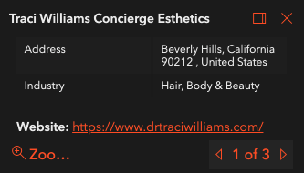
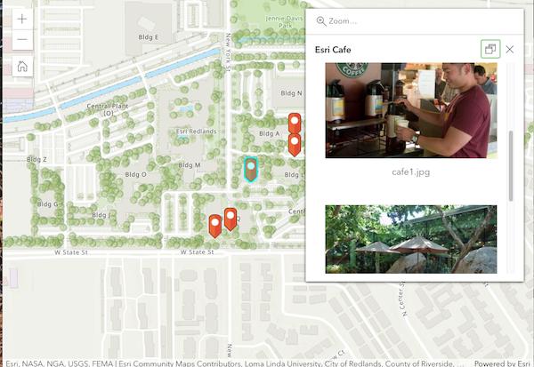

<!-- .slide: data-background="../reveal.js/img/2021/dev-summit/bg-1.png" -->
<!-- .slide: class="title" -->
### ArcGIS API for JavaScript: Better UX with Popups

Kelly Hutchins and Heather Gonzago

----

### **Presentations accessible via GitHub**

👉 Slides & demos: <code>https://bit.ly/3rIORVq</code> 👈

----

### **Map interaction using popups**
 

- Responds to mouse clicks
  
- Provides info on:
  - feature attributes
  - location
  - search results
  

- Customizable

----

### **Popup in the API**

- View has a default instance of <a href="https://developers.arcgis.com/javascript/latest/api-reference/esri-views-View.html#popup" target="_blank">popup</a>
- FeatureLayer has associated <a href="https://developers.arcgis.com/javascript/latest/api-reference/esri-PopupTemplate.html" target="_blank">popupTemplate</a> property
- Position the popup using <a href="https://developers.arcgis.com/javascript/latest/api-reference/esri-widgets-Popup.html#dockOptions" target="_blank"><code>dockOptions</code></a>

----

### **Getting Started**

   [Popup Tutorial](https://developers.arcgis.com/javascript/latest/display-a-pop-up/)

  

----

### **Configure popup content**

 - [Popup Template](https://developers.arcgis.com/javascript/latest/api-reference/esri-PopupTemplate.html#content)

 - Title
 - Content
 - Elements
----

### Content element types

  - [Attachment Content](https://developers.arcgis.com/javascript/latest/api-reference/esri-popup-content-AttachmentsContent.html#displayType)
  - [Text content](https://developers.arcgis.com/javascript/latest/api-reference/esri-popup-content-TextContent.html)
  - [Fields content](https://developers.arcgis.com/javascript/latest/api-reference/esri-popup-content-FieldsContent.html)
  - [Custom content](https://developers.arcgis.com/javascript/latest/api-reference/esri-popup-content-CustomContent.html)
  - [Media content](https://developers.arcgis.com/javascript/latest/api-reference/esri-popup-content-MediaContent.html)

----

### **Kelly Hutchins**

----

###  Build popups in online 

 [webmap json](https://www.arcgis.com/sharing/rest/content/items/3d9c0e67b80a4732a503a81dab2cd4a5/data?f=json)
 
 

----

### Actions

 - [Basic](https://developers.arcgis.com/javascript/latest/sample-code/popup-actions/)
 - [Per feature](https://developers.arcgis.com/javascript/latest/sample-code/popup-custom-action/)
 - [Edit](https://developers.arcgis.com/javascript/latest/sample-code/popup-editaction/)

----

### Feature widget
 Display popup content outside the popup, hover, side panel, accordion etc...
  - [FetchFeatures](https://developers.arcgis.com/javascript/latest/api-reference/esri-widgets-Popup.html#fetchFeatures)
  
  

----

### Style the popup

- [Themes](https://developers.arcgis.com/javascript/latest/sample-code/styling-themes/)
- [Visible Elements](https://developers.arcgis.com/javascript/latest/api-reference/esri-widgets-Popup.html#VisibleElements)

----

<!-- .slide: data-background="../reveal.js/img/2021/dev-summit/bg-5.png" -->

 Please provide your feedback for this
 session by clicking on the session
 survey link directly below the video.