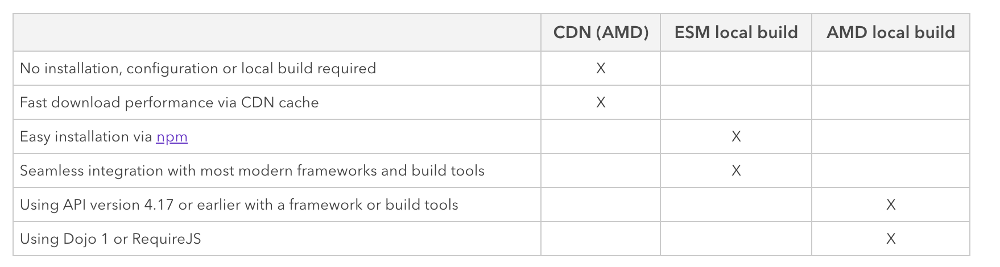
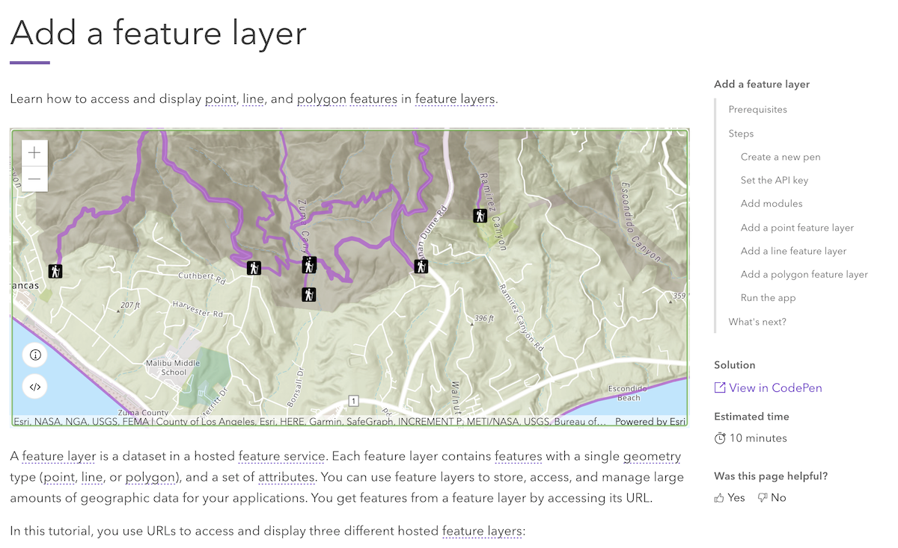
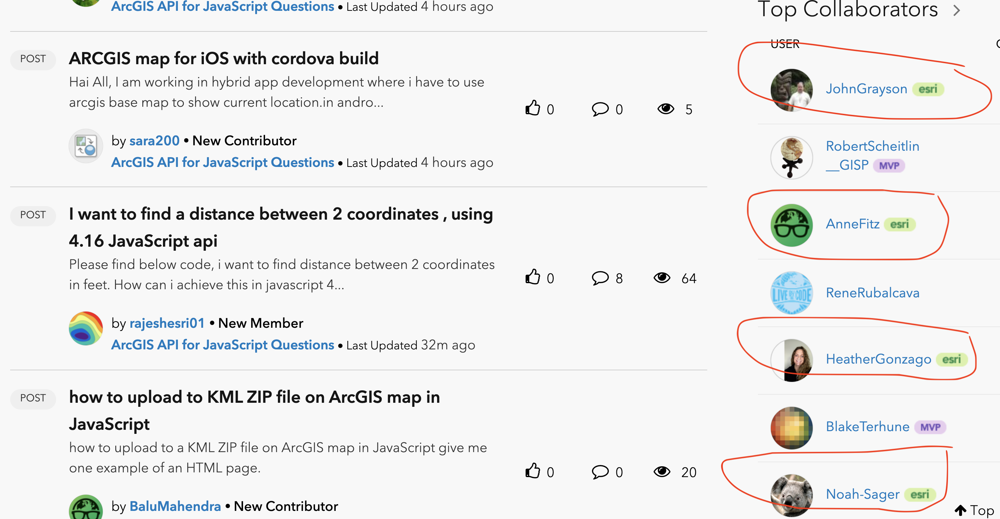
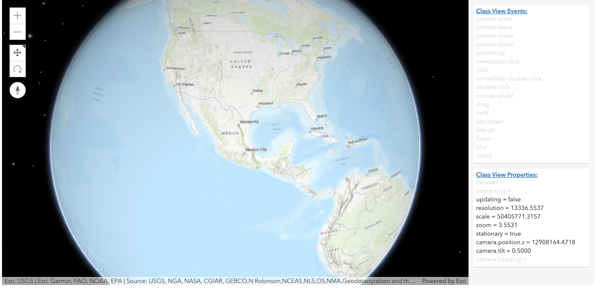
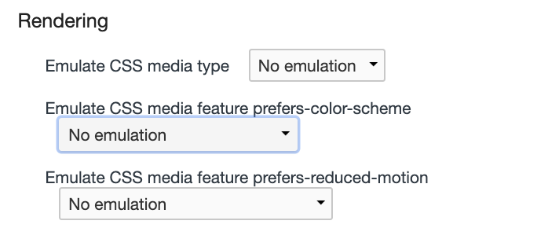
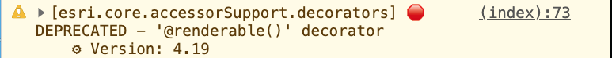
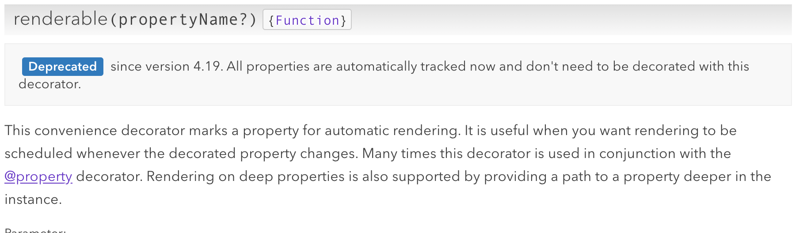
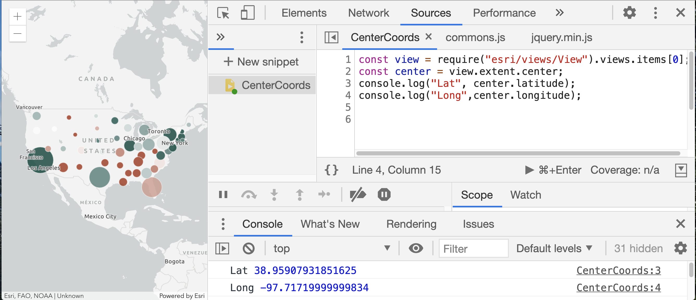
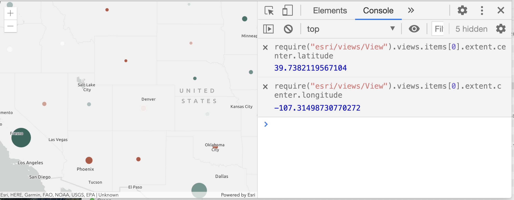
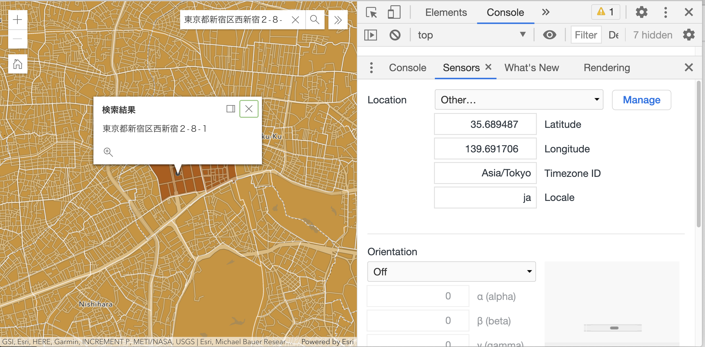

<!-- .slide: data-background="../reveal.js/img/2021/dev-summit/bg-1.png" -->
<!-- .slide: class="title" -->
### Tips and Tricks for Developing and Debugging Apps
Heather Gonzago and Kelly Hutchins

----

### **Presentations accessible via GitHub**
👉 Slides & demos: <code>https://bit.ly/3oQMPAV</code> 👈

----

### **Getting Started**
  - [Getting Started Tutorial](https://developers.arcgis.com/javascript/latest/get-started/)
  - [AMD vs ES Modules](https://developers.arcgis.com/javascript/latest/tooling-intro/)

  

----
### **Detailed Tutorials**

  

----
### **Additional Info**

  - [odoenet](https://odoe.net/blog)

  - [GeoDev Webinar (older version of this session)](https://www.esri.com/en-us/landing-page/product/2018/geodev-webinar-series/arcgis-api-for-javascript-tips-and-tricks-for-developing-and-debugging)

----

### **esri community**
  
  

----

### ArcGIS API for JavaScript snippets 

  - Available on Visual Studio Marketplace
  - Contribute snippets to the GitHub repo 

  <iframe width=800 height=400 src="https://marketplace.visualstudio.com/items?itemName=Esri.arcgis-jsapi-snippets"></iframe>

----

## API Tips

Tips on common questions people ask

----

### Custom Popup

  - [FetchFeatures](https://developers.arcgis.com/javascript/latest/api-reference/esri-widgets-Popup.html#fetchFeatures)
  
  

----
### View events

  - [Handling Events](https://developers.arcgis.com/javascript/latest/api-reference/esri-views-MapView.html#events)
  
  

----

### Constrain visible extent 

 - Use constraint geometry to 
  - Restrict map area
  - Limit search results 

  [Demo](demos/restrict_extent.html)

----

### Request interceptor 

  - [RequestInterceptor](https://developers.arcgis.com/javascript/latest/api-reference/esri-config.html#RequestInterceptor)
    - Add headers
    - Changes before request is sent
    - Changes after request is sent but before returned to caller
    - Log error info for specfic layer errors

    [Real World Example](https://community.esri.com/t5/arcgis-api-for-javascript/how-to-use-a-key-in-an-esrirequest-call/m-p/298401)

----

## Developer Tools

Demo cool features available in developer tools

----

### Light and dark theme

  - Detect user preferences using [<code>prefers-color-scheme</code>](https://developer.mozilla.org/en-US/docs/Web/CSS/@media/prefers-color-scheme)

  

  [Demo](demos/detect_color_theme.html)

----

### Console: Warnings  
  
  

  

----

### Snippet  

  - Create code snippets to run in browser dev tools
  
  

----

### Create Live Expression  

  - Get coordinates as you navigate the map
  
  

----
### Sensors 

  - Modify current location and locale 
  
  

----